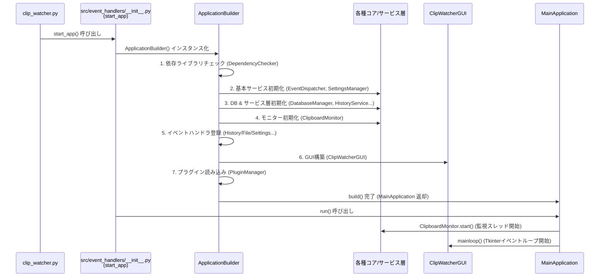
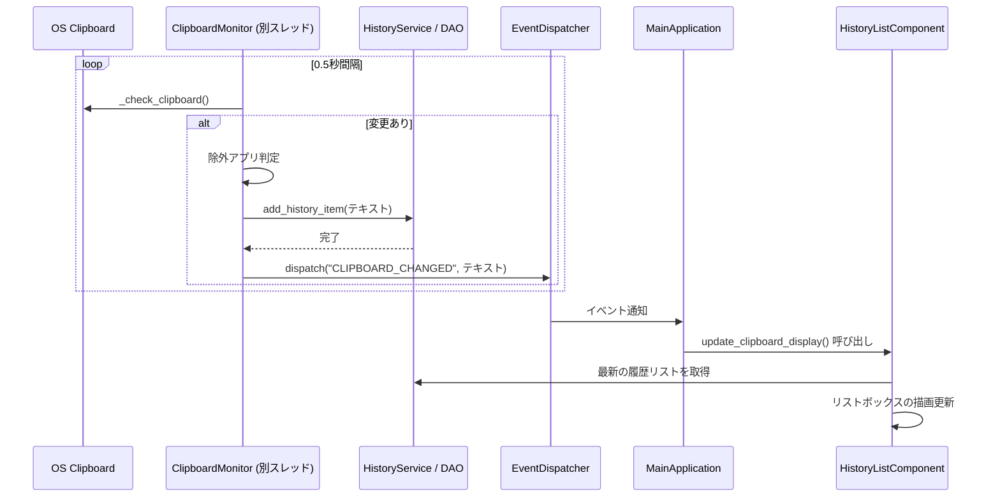
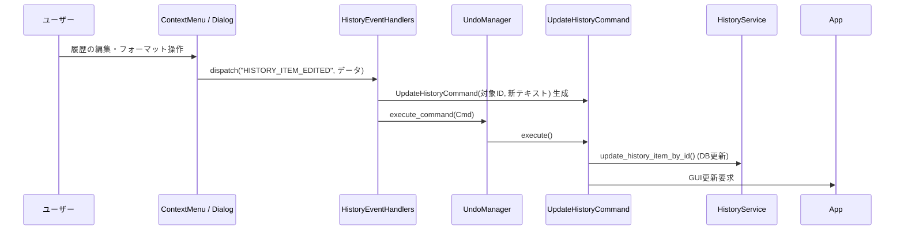

# ClipWatcher コア層プログラム仕様書

本書は、`src/core/` ディレクトリ配下に分割されたコアモジュール群の責務と、それらがどのように連携してアプリケーションを起動・制御しているか（プログラムフロー）を解説する技術仕様書です。

## 1. コア層のモジュール構成

コア層は、関心の分離（Separation of Concerns）に基づき、以下のサブパッケージに分割されています。

| サブパッケージ | 主な役割と構成クラス |
| :--- | :--- |
| `bootstrap/` | **起動と依存関係の構築** ・`ApplicationBuilder`: 各サービス・UIを生成し依存性を注入（DI）する。 ・`BaseApplication`: アプリケーションの基底インターフェース。 ・`DependencyChecker`: 起動前の環境・依存ライブラリのチェック。 |
| `clipboard/` | **OSクリップボード監視** ・`ClipboardMonitor`: OSのクリップボード変更を常時監視し、変更検知時にイベントを発行する。 |
| `events/` | **イベント駆動と状態遷移** ・`EventDispatcher`: Pub/Subモデルによるコンポーネント間通信のハブ。 ・`commands.py`: Undo/Redo機能のためのコマンドパターン実装（`UpdateHistoryCommand`等）。 |
| `config/` | **設定管理と状態** ・`SettingsManager`: `settings.json` の読み書き。 ・`AppStatus`: アプリ全体の状態保持。 |
| `app_main.py` | `BaseApplication` を実装する具象クラス。ビルドされたシステムを統括する。 |

---

## 2. アプリケーション起動フロー (Bootstrap Flow)

アプリケーションの起動は、エントリーポイント (`clip_watcher.py`) から `start_app()` 関数を介して開始され、`ApplicationBuilder` によって段階的に構築されます。

**【起動時のポイント】**
- **DI (依存性注入)**: サービスやハンドラは互いに直接インスタンス化せず、`ApplicationBuilder` が必要なオブジェクト（`EventDispatcher` など）をコンストラクタ経由で渡します。これにより循環参照を防いでいます。

---

## 3. クリップボード監視フロー (Monitoring Flow)

バックグラウンドで動作する `ClipboardMonitor` がクリップボードの変更を検知し、それが GUI に反映されるまでのフローです。

**【監視フローのポイント】**
- `ClipboardMonitor` は別スレッドで稼働しますが、直接 GUI を操作しません。`EventDispatcher` を介してイベントを発行することで、Tkinterのメインスレッド（`MainApplication` 側）で安全に描画更新が行われます。

---

## 4. イベント・コマンド制御フロー (Control Flow)

ユーザーが GUI からアクションを起こした際のフローです（例：履歴のフォーマット適用や編集）。

**【制御フローのポイント】**
- 操作はすべて `src/event_handlers/` 内のハンドラで受け止めます。
- 状態を変更する操作（更新、削除など）は `src/core/events/commands.py` に定義されたコマンドオブジェクトにカプセル化されます。これにより、将来的に `undo()` メソッドを呼ぶだけでデータベースと GUI の状態を元に戻すことができます。
