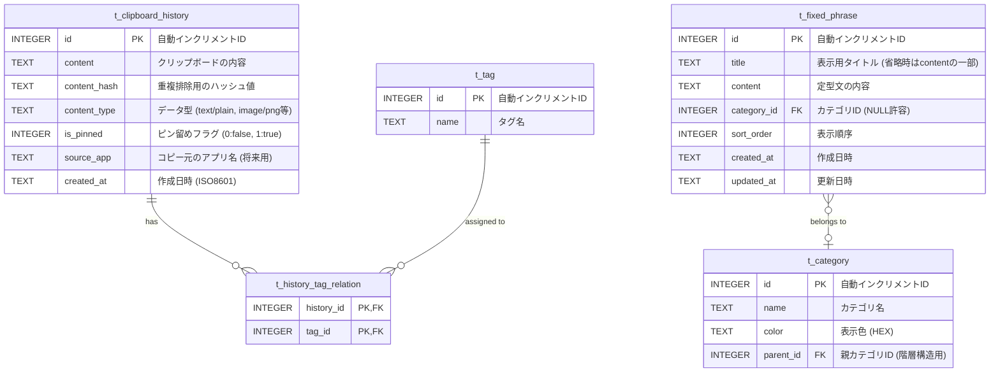

# データベース設計書 (SQLite)

本ドキュメントは、Clip_Watcherのデータ永続化層をJSONからSQLiteへ移行、および拡張性を考慮したデータベース設計の詳細です。

## 1. ER図 (Entity Relationship Diagram)

## 2. テーブル定義 (物理設計)

### 2.1. クリップボード履歴 (`t_clipboard_history`)
ユーザーのクリップボード履歴を保存するメインテーブルです。大量のデータを扱うため、検索性能を意識したインデックス設計を含みます。

| 物理名 | 論理名 | データ型 | 制約 | 説明 |
| :--- | :--- | :--- | :--- | :--- |
| `id` | ID | `INTEGER` | `PRIMARY KEY AUTOINCREMENT` | 一意の識別子 |
| `content` | 内容 | `TEXT` | `NOT NULL` | クリップボードのテキストデータ |
| `content_hash` | 内容ハッシュ | `TEXT` | `NOT NULL` | 重複データの高速検索・排除用 (MD5/SHA256等) |
| `content_type` | コンテンツタイプ | `TEXT` | `DEFAULT 'text/plain'` | MIMEタイプ形式。将来的な画像対応用。 |
| `is_pinned` | ピン留め | `INTEGER` | `DEFAULT 0` | 0: なし, 1: ピン留め済み (自動削除対象外) |
| `source_app` | コピー元アプリ | `TEXT` | `NULLABLE` | どのウィンドウからコピーされたか (拡張機能) |
| `created_at` | 作成日時 | `TEXT` | `NOT NULL` | ISO8601形式のタイムスタンプ |

*   **インデックス**:
    *   `idx_history_created_at`: `created_at DESC` (履歴表示用)
    *   `idx_history_hash`: `content_hash` (重複チェック用)

### 2.2. 定型文 (`t_fixed_phrase`)
ユーザーが登録した定型文を管理します。現在の単純なリスト構造から、タイトルやカテゴリを持つ構造へ拡張します。

| 物理名 | 論理名 | データ型 | 制約 | 説明 |
| :--- | :--- | :--- | :--- | :--- |
| `id` | ID | `INTEGER` | `PRIMARY KEY AUTOINCREMENT` | 一意の識別子 |
| `title` | タイトル | `TEXT` | `NULLABLE` | リスト表示用の短い名前 |
| `content` | 内容 | `TEXT` | `NOT NULL` | 挿入される実際のテキスト |
| `category_id` | カテゴリID | `INTEGER` | `NULLABLE`, `FOREIGN KEY` | `t_category.id` への参照 |
| `sort_order` | 表示順 | `INTEGER` | `DEFAULT 0` | ユーザー定義の並び順 |
| `updated_at` | 更新日時 | `TEXT` | `NOT NULL` | 最終更新日時 |

*   **インデックス**:
    *   `idx_phrase_sort`: `category_id, sort_order` (一覧表示用)

### 2.3. カテゴリ (`t_category`)
定型文（将来的に履歴も）を整理するためのフォルダ/カテゴリ機能を提供します。

| 物理名 | 論理名 | データ型 | 制約 | 説明 |
| :--- | :--- | :--- | :--- | :--- |
| `id` | ID | `INTEGER` | `PRIMARY KEY AUTOINCREMENT` | 一意の識別子 |
| `name` | カテゴリ名 | `TEXT` | `NOT NULL` | |
| `color` | 色 | `TEXT` | `NULLABLE` | UI表示用のカラーコード (例: #FF5733) |
| `parent_id` | 親カテゴリID | `INTEGER` | `NULLABLE` | サブカテゴリを作る場合の自己参照 |

### 2.4. タグ (`t_tag`) & 関連 (`t_history_tag_relation`)
履歴項目に対して柔軟なタグ付けを行うための拡張テーブルです。

**t_tag**
| 物理名 | 論理名 | データ型 | 制約 | 説明 |
| :--- | :--- | :--- | :--- | :--- |
| `id` | ID | `INTEGER` | `PRIMARY KEY AUTOINCREMENT` | |
| `name` | タグ名 | `TEXT` | `NOT NULL, UNIQUE` | ユーザー入力タグ |

**t_history_tag_relation**
| 物理名 | 論理名 | データ型 | 制約 | 説明 |
| :--- | :--- | :--- | :--- | :--- |
| `history_id` | 履歴ID | `INTEGER` | `NOT NULL, FOREIGN KEY` | `t_clipboard_history.id` |
| `tag_id` | タグID | `INTEGER` | `NOT NULL, FOREIGN KEY` | `t_tag.id` |
| | | | `PRIMARY KEY(history_id, tag_id)` | 複合主キー |

## 3. 移行・実装に関する考慮事項

1.  **データ型のマッピング**:
    *   SQLiteには日付型がないため、`TEXT` (ISO8601文字列) または `INTEGER` (Unix Time) を使用します。可読性とデバッグの容易さから `TEXT` を推奨します。
    *   Booleanは `INTEGER` (0/1) で管理します。

2.  **既存データからの移行**:
    *   `history.json` -> `t_clipboard_history`: 単純な文字列リストをインポートし、`created_at` はインポート実行時刻、`content_hash` は計算して生成します。
    *   `fixed_phrases.json` -> `t_fixed_phrase`: 文字列を `content` に格納し、`title` はNULLまたは `content` の先頭20文字等を設定します。

3.  **パフォーマンスチューニング**:
    *   `t_clipboard_history` は肥大化しやすいため、定期的に古いデータ（`is_pinned=0` のもの）を削除する `VACUUM` 処理や自動削除ロジックの実装が必要です。