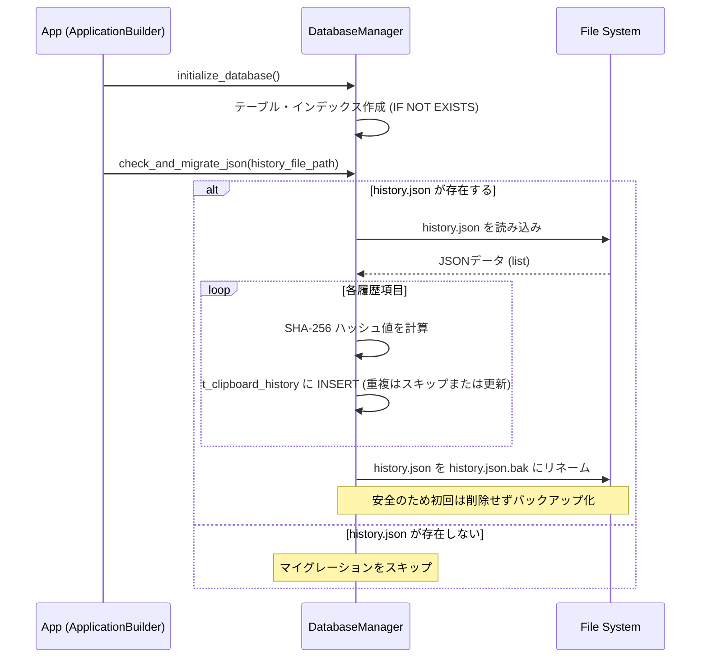
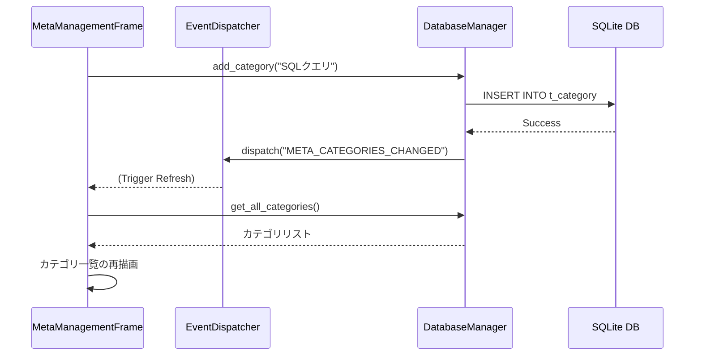

# メタ管理機能 & SQLite移行 詳細設計書

本ドキュメントは、Clip_Watcherにおける「クリップボード履歴データのSQLite完全移行」および「ユーザー定義カテゴリ付き定型文（メタ管理）タブの新設」に関する詳細設計・仕様書です。

---

## 1. データベース物理設計

SQLite データベースファイル（`clip_watcher.db`）内に以下の3つのテーブルを作成します。

### 1.1 `t_clipboard_history` (クリップボード履歴)
クリップボードから監視・収集した履歴データを保存します。

| 物理名 | 論理名 | データ型 | 制約 | 説明 |
| :--- | :--- | :--- | :--- | :--- |
| `id` | 履歴ID | `INTEGER` | `PRIMARY KEY AUTOINCREMENT` | 一意の識別子 |
| `content` | 履歴テキスト | `TEXT` | `NOT NULL` | コピーされたテキスト内容 |
| `content_hash` | 重複排除用ハッシュ | `TEXT` | `NOT NULL` | 重複判定用のSHA-256ハッシュ |
| `is_pinned` | ピン留めフラグ | `INTEGER` | `NOT NULL DEFAULT 0` | `0`: 通常, `1`: ピン留め（自動クリーンアップ対象外） |
| `created_at` | 作成日時 | `REAL` | `NOT NULL` | 登録時のUnix Epoch時間 (`time.time()`) |

*   **インデックス**:
    *   `idx_history_hash` ON `t_clipboard_history(content_hash)` (重複チェックの高速化)
    *   `idx_history_created` ON `t_clipboard_history(created_at DESC)` (一覧取得・ソート用)

### 1.2 `t_category` (メタ管理カテゴリ)
ユーザーが定義する定型文の分類用カテゴリです。

| 物理名 | 論理名 | データ型 | 制約 | 説明 |
| :--- | :--- | :--- | :--- | :--- |
| `id` | カテゴリID | `INTEGER` | `PRIMARY KEY AUTOINCREMENT` | 一意の識別子 |
| `name` | カテゴリ名 | `TEXT` | `NOT NULL UNIQUE` | 重複を許容しないカテゴリ名 |
| `sort_order` | 表示順序 | `INTEGER` | `NOT NULL DEFAULT 0` | UI上の表示並び順 |

### 1.3 `t_meta_phrase` (カテゴリ別定型文 - メタ管理)
カテゴリに紐づけられた定型文データです。

| 物理名 | 論理名 | データ型 | 制約 | 説明 |
| :--- | :--- | :--- | :--- | :--- |
| `id` | メタ項目ID | `INTEGER` | `PRIMARY KEY AUTOINCREMENT` | 一意の識別子 |
| `title` | タイトル | `TEXT` | `NOT NULL` | 一覧表示用のタイトル |
| `content` | 定型文内容 | `TEXT` | `NOT NULL` | コピー対象となるテキスト内容 |
| `category_id` | カテゴリID | `INTEGER` | `NOT NULL`, `FOREIGN KEY` | `t_category.id` への参照 (ON DELETE CASCADE) |
| `sort_order` | 表示順序 | `INTEGER` | `NOT NULL DEFAULT 0` | 同一カテゴリ内での表示並び順 |
| `created_at` | 作成日時 | `REAL` | `NOT NULL` | 登録時のUnix Epoch時間 |

*   **インデックス**:
    *   `idx_meta_phrase_category` ON `t_meta_phrase(category_id, sort_order)` (カテゴリ別フィルタ用)

---

## 2. マイグレーション（データ移行）処理フロー

アプリケーションの初回起動時またはDB初期化時に、既存の `history.json` から SQLite への自動データ移行を行います。



### 重複排除ロジック
移行および新規コピー登録時、`content_hash` （SHA-256）を用いて同一テキストの重複を防ぎます。
*   既に同一ハッシュの項目が存在する場合：
    *   **ピン留め状態**: 元のピン留め状態を維持。
    *   **日時**: `created_at` を最新日時に更新し、履歴の最上位に移動させます。

---

## 3. UI/UX 設計

### 3.1 メタ管理タブ (`MetaManagementFrame`) のレイアウト

`tk.PanedWindow` を用いて、ウィンドウを左右に分割します。

```
+-----------------------------------------------------------------------+
|  クリップボード履歴  |  定型文 (固定)  |  ★メタ管理 (新規)  |  設定...      |
+-----------------------------------------------------------------------+
|                                                                       |
|  +------------------------+  +-------------------------------------+  |
|  | カテゴリ一覧            |  | メタ定型文一覧 (カテゴリ: [選択中]) |  |
|  | +--------------------+ |  | +---------------------------------+ |  |
|  | | [すべて]           | |  | | タイトル       | 内容           | |  |
|  | | 開発用テンプレート | |  | | +--------------+----------------+ | |  |
|  | | メール定型文       | |  | | 署名           | 株式会社〇〇...| |  |
|  | | SQLクエリ          | |  | | 返信テンプレート| お世話に...    | |  |
|  | +--------------------+ |  | +---------------------------------+ |  |
|  |                        |  |                                     |  |
|  | [ 追加 ] [編集] [削除] |  | [コピー] [ 追加 ] [ 編集 ] [ 削除 ]  |  |
|  +------------------------+  +-------------------------------------+  |
|                                                                       |
+-----------------------------------------------------------------------+
```

1.  **左側（カテゴリ管理）**:
    *   `Listbox` を使用し、登録されているカテゴリを一覧表示。最上部には「[すべて] (All)」の特殊項目を表示。
    *   下部に「追加 (Add Category)」「編集 (Edit Category)」「削除 (Delete Category)」ボタンを配置。
2.  **右側（メタ定型文管理）**:
    *   `ttk.Treeview`（複数列表示）を使用し、選択されたカテゴリに属する定型文の `タイトル` と `内容（プレビュー）` を表形式で表示。
    *   リストをダブルクリックした際、対象の定型文内容をクリップボードにコピーし、通知を表示。
    *   下部に「コピー (Copy)」「追加 (Add)」「編集 (Edit)」「削除 (Delete)」ボタンを配置。

### 3.2 ダイアログ設計

1.  **カテゴリ作成/編集ダイアログ (`CategoryEditDialog`)**:
    *   単一の入力フィールド（カテゴリ名）を持つシンプルな `Toplevel` ウィンドウ。
    *   バリデーション: 空白不可、重複不可。
2.  **メタ定型文作成/編集ダイアログ (`MetaPhraseEditDialog`)**:
    *   入力フィールド:
        *   `タイトル` (`CustomEntry`)
        *   `カテゴリ` (`ttk.Combobox` - 登録済みのカテゴリから選択)
        *   `内容` (`CustomText`)
    *   バリデーション: タイトル・内容ともに空白不可。

---

## 4. イベント・データフロー

UI操作によるデータベースの変更は、すべて `DatabaseManager` を通じて即時に永続化され、`EventDispatcher` により他のコンポーネントへ通知されます。



### ログ出力ルール (`RULE[user_global]`)
全てのデータベース処理およびイベントハンドラは、標準出力（`print`）を一切使用せず、以下のロガーインスタンスを介してトレースおよびエラーの記録を行います。

```python
import logging

logger = logging.getLogger(__name__)

# 使用例
logger.info("SQLite データベース接続を初期化しました。")
logger.error("カテゴリの追加に失敗しました: %s", err_msg, exc_info=True)
```
