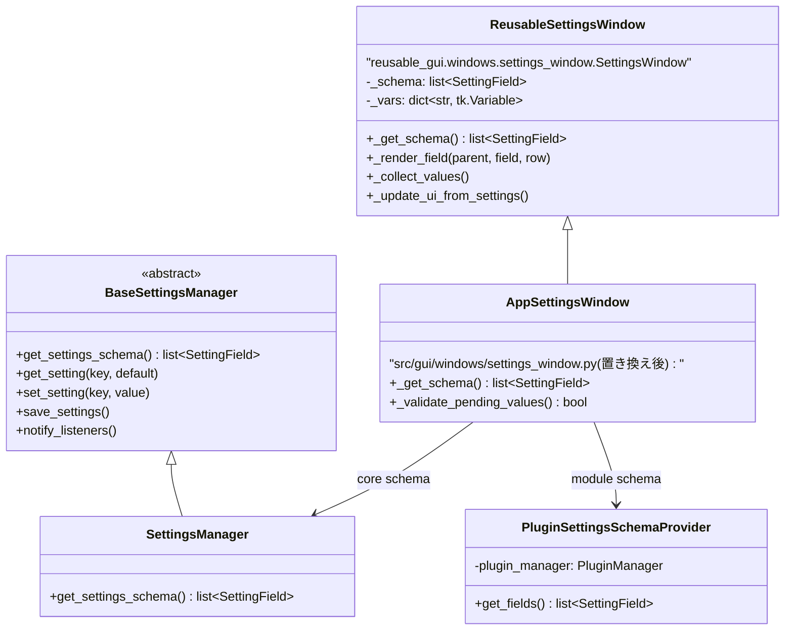
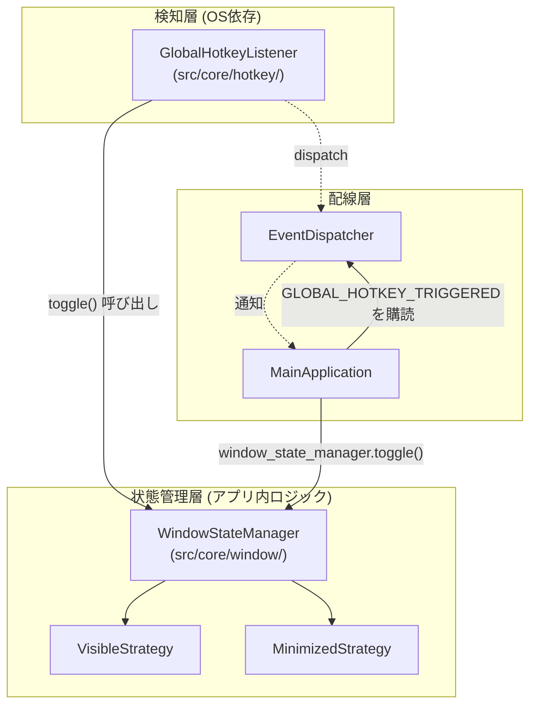
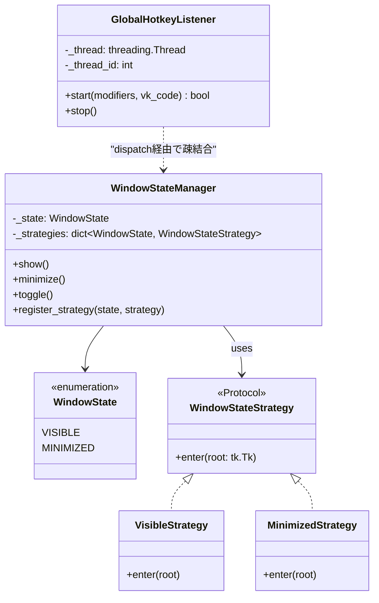
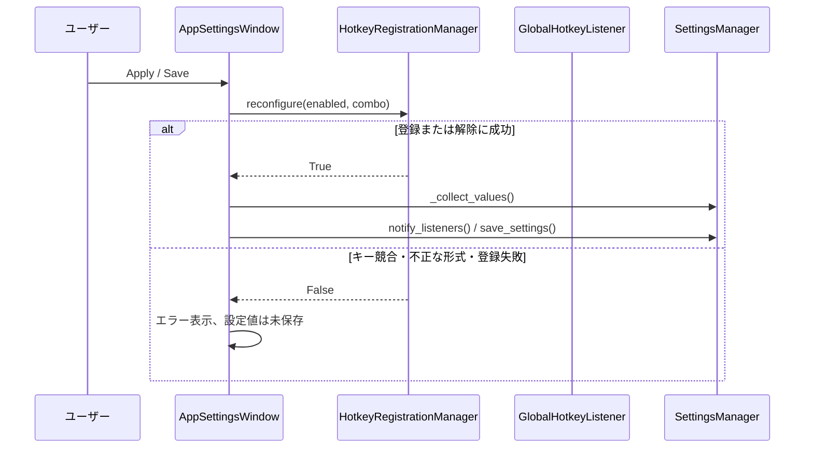
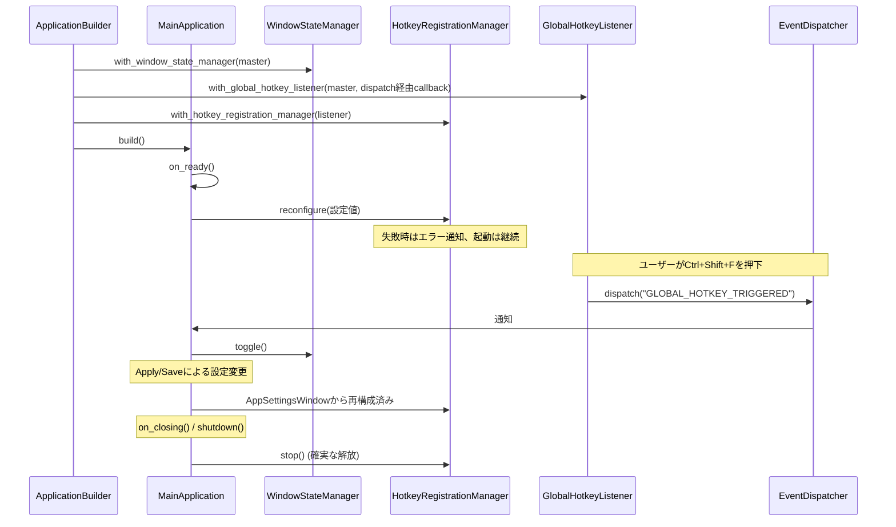

# 改造仕様書: 設定画面のスキーマ駆動化 と グローバルホットキー機能の追加

作成日: 2026年8月18日
対象: `src/gui/windows/settings_window.py`, `src/core/config/settings_manager.py`,
      `reusable_gui/`, `src/core/`（新設サブパッケージ）

---

## 1. 目的と背景

### 1.1 目的
1. 現在手書きで実装されている `src/gui/windows/settings_window.py` を、
   スキーマ駆動（`SettingField` + 汎用レンダラー）方式に置き換える。
2. その基盤の上に、グローバルホットキー（デフォルト: `Ctrl+Shift+F`）による
   ウィンドウの「表示 ⇔ 最小化」トグル機能を追加する。
3. 将来のタスクバー最小化・トレイ格納などの追加状態を、既存コードへの
   変更を最小限にして組み込めるクラス設計にする。

### 1.2 背景・現状の課題
- `src/gui/windows/settings_window.py` は設定項目1つにつき
  「変数宣言 → ウィジェット生成 → 保存処理 → 復元処理」の4箇所を
  手動で同期する必要があり、項目追加時の記述量と不整合リスクが大きい。
- `reusable_gui/` 配下には、`SettingField` のリスト（スキーマ）のみから
  UIを動的生成する汎用実装（`reusable_gui/windows/settings_window.py`）が
  既に存在するが、アプリ側 (`src/`) からは未使用。
- ホットキー機能・ウィンドウ状態管理・システムトレイ常駐は、いずれも
  「OS依存の検知処理」と「アプリ内の状態遷移」という2層構造を持つ点で
  共通しており、今回はこの2層を明確に分離した設計とする。
- 標準ライブラリ（`tkinter`, `ctypes`, `threading`）のみで実装する方針。
  `pywin32` は既存依存（クリップボード監視のフォールバック用途）を
  超えて新たに使用しない。

---

## 2. スコープ

### 2.1 対応する変更
- `src/gui/windows/settings_window.py` を `reusable_gui/windows/settings_window.py`
  ベースの薄いサブクラスに置き換える。
- `src/core/config/settings_manager.py` の `get_settings_schema()` を、
  コア設定の唯一の定義（source of truth）とする。
- プラグイン由来の `Modules` タブを、`PluginSettingsSchemaProvider` による
  動的スキーマとして正式にスコープへ含める。
- `reusable_gui/core/config/schema.py` の `WidgetType` に
  `HOTKEY_CAPTURE` を追加する。
- 新設: `src/core/hotkey/` （グローバルホットキー検知・登録状態の管理）
- 新設: `src/core/window/` （ウィンドウ表示状態管理）
- `SettingsManager` のデフォルト設定に `global_hotkey_enabled`,
  `global_hotkey_combo` を追加する。
- `ApplicationBuilder` / `MainApplication` へのライフサイクル組み込み。

### 2.2 対応しない変更（別スコープ）
- 複数のグローバルホットキーの同時サポート。本改造は表示/最小化用の
  単一ホットキーだけを対象とし、`HOTKEY_ID=1` 固定で実装する。
- システムトレイ常駐の実際の実装（`WindowState` の拡張余地のみ確保）。
- 設定画面のUIデザイン刷新（レイアウト・配色は既存のまま踏襲）。
- 現在UI生成コードがコメントアウトされ、実運用で機能していない
  「設定画面タブの表示切替」 (`show_*_settings_tab`) の再有効化または削除。
  既存の設定値は後方互換のため保持するが、移行後のスキーマには含めず、
  新たなUIも提供しない。整理方針は将来別要件として決定する。

---

## 3. 設定画面のスキーマ駆動化 詳細仕様

### 3.1 現状構成と移行後構成の比較

| 項目               | 現状 (`src/gui/windows/settings_window.py`) | 移行後                                                                                                     |
| :----------------- | :------------------------------------------ | :--------------------------------------------------------------------------------------------------------- |
| 設定項目の定義場所 | `__init__` 内の `tk.Variable` 宣言に散在    | コア設定は `SettingsManager.get_settings_schema()`、プラグイン設定は `PluginSettingsSchemaProvider` に分離 |
| UI生成             | `_create_widgets()` に手書きgridレイアウト  | `reusable_gui` 側 `_render_field()` が `WidgetType` に応じて自動生成                                       |
| 保存処理           | `_save_settings_logic()` に手動列挙         | `_collect_values()` が合成済みスキーマを走査して自動収集                                                   |
| 復元処理           | `_update_ui_from_settings()` に手動列挙     | 合成済みスキーマの走査により自動復元                                                                       |
| Modulesタブ        | 個別の `tool_tab_vars` を手動構築           | GUIプラグイン一覧から `SettingField` を動的生成                                                            |
| クラス階層         | `BaseToplevelGUI` を直接継承                | `reusable_gui.windows.settings_window.SettingsWindow` を継承した薄いラッパー                               |

### 3.2 クラス設計



- `AppSettingsWindow` は `ReusableSettingsWindow` を継承する薄いクラスとし、
  テーマ適用・翻訳・スキーマ合成・保存前検証だけを担当する。
- `ReusableSettingsWindow` は、既存の直接
  `settings_manager.get_settings_schema()` 呼び出しを保護メソッド
  `_get_schema()` に置き換える。既定実装はコアスキーマを返し、
  `AppSettingsWindow` がコアスキーマとプラグインスキーマを合成する。
- `WidgetType.HOTKEY_CAPTURE` のレンダリングは `reusable_gui` 側に
  汎用実装として追加する。ホットキーの登録可否というアプリ固有処理は
  `AppSettingsWindow._validate_pending_values()` に閉じ込める。

### 3.3 Modulesタブのスキーマ合成

`SettingsManager` が `PluginManager` に依存してはならないため、
`get_settings_schema()` 内でプラグインを検索しない。代わりに
`src/plugins/settings_schema_provider.py` に
`PluginSettingsSchemaProvider` を新設する。

```python
class PluginSettingsSchemaProvider:
    def __init__(self, plugin_manager: PluginManager) -> None:
        self._plugin_manager = plugin_manager

    def get_fields(self) -> list[SettingField]:
        fields: list[SettingField] = []
        for plugin in self._plugin_manager.get_gui_plugins():
            setting_key = f"show_{plugin.name.lower().replace(' ', '_')}_tab"
            fields.append(
                SettingField(
                    key=setting_key,
                    label=f"Show {plugin.name} Tab",
                    widget_type=WidgetType.CHECKBUTTON,
                    tab="Modules",
                    group="Main Window Tabs",
                    default=True,
                )
            )
        return fields
```

`AppSettingsWindow._get_schema()` は以下のように合成する。

```python
return [
    *self.settings_manager.get_settings_schema(),
    *PluginSettingsSchemaProvider(self.app.plugin_manager).get_fields(),
]
```

これにより、GUIプラグインを追加・削除してもModulesタブの表示切替項目が
自動追従し、設定管理層とプラグイン管理層は直接結合しない。

### 3.4 移行手順

1. **`SettingsManager` を `BaseSettingsManager` に適合させる**
   - `src/core/config/settings_manager.py` の `SettingsManager` が
     `reusable_gui.core.config.settings_manager.BaseSettingsManager` を
     継承するように変更する。
2. **コアスキーマを完全化する**
   - General/History/Notifications/Font/Excluded Apps/Hotkey の全項目を
     `SettingsManager.get_settings_schema()` に列挙する。
3. **`PluginSettingsSchemaProvider` を追加する**
   - `PluginManager.get_gui_plugins()` を基に `Modules` タブの
     `show_{plugin}_tab` 項目を動的生成する。
4. **`ReusableSettingsWindow` を拡張する**
   - `_get_schema()` と保存前フック `_validate_pending_values()` を追加する。
   - `_apply_only()` / `_save_and_close()` は、検証に成功した場合のみ
     `_collect_values()` と通知・保存を実行する。
5. **`AppSettingsWindow` を新規作成し、既存 `SettingsWindow` を置き換える**
   - `src/gui/windows/settings_window.py` の内容を全面差し替える。
   - `_get_schema()` でコア・Modulesスキーマを合成する。
   - テーマ適用と翻訳キー対応をフックする。
6. **`app_main.py` の `open_settings_window()` は変更不要**
   - `self.create_toplevel(SettingsWindow, self.settings_manager)` の
     呼び出し口は変わらない。

### 3.5 影響範囲の確認

| 呼び出し元                                     | 現状の依存内容                                   | 変更後の影響                                        |
| :--------------------------------------------- | :----------------------------------------------- | :-------------------------------------------------- |
| `src/core/app_main.py: open_settings_window()` | `SettingsWindow(master, self, settings_manager)` | 変更なし（コンストラクタ互換）                      |
| `src/gui/main_gui.py`                          | `show_{plugin}_tab` でGUIプラグインのタブを制御  | 変更なし。Modulesスキーマが既存キーを生成・保存する |
| `src/core/bootstrap/application_builder.py`    | 未参照                                           | 影響なし                                            |
| `settings.json` の保存形式                     | `dict[str, Any]`                                 | 変更なし。既存の `show_{plugin}_tab` 値を継承する   |

---

## 4. グローバルホットキー機能 詳細仕様

### 4.1 要件
- デフォルトキー: `Ctrl+Shift+F`
- 動作: トリガー時にウィンドウの「表示 ⇔ 最小化」をトグルする。
- タスクバーの最小化ボタンなど、OS操作による状態変化にも追従する。
- 将来、トレイ格納などの追加状態を既存コード変更なしで組み込める設計とする。
- キー競合時は起動を継続し、ログとエラーダイアログで通知する
  （§4.6参照）。

### 4.2 レイヤー構成



- `GlobalHotkeyListener` は「キー入力を検知して通知する」以外の責務を持たない。
- `WindowStateManager` は「今どの状態か」「状態が変わったら何をするか」を
  `WindowState` (Enum) と `WindowStateStrategy` (Protocol) の組み合わせで
  一元管理する。
- 両者の間には直接依存を作らず、`EventDispatcher` の
  `GLOBAL_HOTKEY_TRIGGERED` イベントを介して疎結合に接続する
  （既存アーキテクチャの Pub/Sub 方針に合わせる）。

### 4.3 クラス設計



### 4.4 ファイル配置

```text
src/core/
├── hotkey/                          # [新設]
│   ├── __init__.py
│   ├── global_hotkey_listener.py    # GlobalHotkeyListener, キー文字列変換
│   └── exceptions.py                # HotkeyRegistrationError（必要時）
└── window/                          # [新設]
    ├── __init__.py
    └── window_state_manager.py      # WindowState, WindowStateStrategy, WindowStateManager
```

- `hotkey/` は `clipboard/` と同じ「OS監視インフラ」の並びに置く
  （`review_2026_05_31_architecture_directory_review.md` のディレクトリ方針に整合）。
- `window/` はアプリのUI状態管理として独立させ、将来トレイ格納の
  `TrayHiddenStrategy` 等を追加する際もこのパッケージ内に収める。

### 4.5 実装詳細

#### 4.5.1 `WindowState` / `WindowStateManager`

```python
# src/core/window/window_state_manager.py
from __future__ import annotations

import logging
import tkinter as tk
from enum import Enum, auto
from typing import Protocol

logger = logging.getLogger(__name__)


class WindowState(Enum):
    VISIBLE = auto()
    MINIMIZED = auto()
    # 将来追加: HIDDEN_TO_TRAY = auto()


class WindowStateStrategy(Protocol):
    def enter(self, root: tk.Tk) -> None: ...


class VisibleStrategy:
    def enter(self, root: tk.Tk) -> None:
        root.deiconify()
        root.lift()
        root.focus_force()


class MinimizedStrategy:
    def enter(self, root: tk.Tk) -> None:
        root.iconify()


class WindowStateManager:
    def __init__(self, root: tk.Tk) -> None:
        self._root = root
        self._state = WindowState.VISIBLE
        self._strategies: dict[WindowState, WindowStateStrategy] = {
            WindowState.VISIBLE: VisibleStrategy(),
            WindowState.MINIMIZED: MinimizedStrategy(),
        }
        root.bind("<Unmap>", self._on_unmap, add="+")
        root.bind("<Map>", self._on_map, add="+")

    @property
    def state(self) -> WindowState:
        return self._state

    def show(self) -> None:
        self._transition_to(WindowState.VISIBLE)

    def minimize(self) -> None:
        self._transition_to(WindowState.MINIMIZED)

    def toggle(self) -> None:
        if self._state == WindowState.VISIBLE:
            self.minimize()
        else:
            self.show()

    def register_strategy(
        self, state: WindowState, strategy: WindowStateStrategy
    ) -> None:
        self._strategies[state] = strategy

    def _transition_to(self, new_state: WindowState) -> None:
        strategy = self._strategies.get(new_state)
        if strategy is None:
            logger.warning(
                "未知のウィンドウ状態への遷移が要求されました: %s", new_state
            )
            return
        strategy.enter(self._root)
        self._state = new_state

    def _on_unmap(self, event: tk.Event) -> None:
        if event.widget == self._root:
            self._state = WindowState.MINIMIZED

    def _on_map(self, event: tk.Event) -> None:
        if event.widget == self._root:
            self._state = WindowState.VISIBLE
```

#### 4.5.2 `GlobalHotkeyListener` とキー文字列変換

```python
# src/core/hotkey/global_hotkey_listener.py
from __future__ import annotations

import ctypes
import ctypes.wintypes
import logging
import threading
import tkinter as tk
from collections.abc import Callable

logger = logging.getLogger(__name__)

MOD_ALT = 0x0001
MOD_CONTROL = 0x0002
MOD_SHIFT = 0x0004
MOD_WIN = 0x0008
MOD_NOREPEAT = 0x4000

WM_HOTKEY = 0x0312
WM_QUIT = 0x0012
HOTKEY_ID = 1

_MODIFIER_MAP = {
    "ctrl": MOD_CONTROL,
    "alt": MOD_ALT,
    "shift": MOD_SHIFT,
    "win": MOD_WIN,
}


def parse_hotkey_string(combo: str) -> tuple[int, int]:
    """
    "Ctrl+Shift+F" のような文字列を (modifiers, vk_code) に変換する。
    不正な形式の場合は ValueError を投げる。
    """
    parts = [p.strip().lower() for p in combo.split("+") if p.strip()]
    if len(parts) < 2:
        raise ValueError(f"ホットキー文字列の形式が不正です: {combo!r}")

    modifiers = 0
    key_part = parts[-1]
    for mod in parts[:-1]:
        if mod not in _MODIFIER_MAP:
            raise ValueError(f"不明な修飾キーです: {mod!r}")
        modifiers |= _MODIFIER_MAP[mod]

    if len(key_part) != 1 or not key_part.isalnum():
        raise ValueError(f"対応していないキーです: {key_part!r}")
    vk_code = ord(key_part.upper())
    return modifiers, vk_code


def format_hotkey(modifiers: int, vk_code: int) -> str:
    """(modifiers, vk_code) から "Ctrl+Shift+F" 形式の文字列を生成する。"""
    parts = []
    if modifiers & MOD_CONTROL:
        parts.append("Ctrl")
    if modifiers & MOD_ALT:
        parts.append("Alt")
    if modifiers & MOD_SHIFT:
        parts.append("Shift")
    if modifiers & MOD_WIN:
        parts.append("Win")
    parts.append(chr(vk_code))
    return "+".join(parts)


class GlobalHotkeyListener:
    """
    RegisterHotKey を用いてグローバルホットキーを監視するクラス。
    OSクリップボード監視 (ClipboardMonitor) と同様に、専用スレッド +
    tk_root.after() でメインスレッドへ安全に橋渡しする。
    """

    def __init__(self, tk_root: tk.Tk, on_triggered: Callable[[], None]) -> None:
        self.tk_root = tk_root
        self.on_triggered = on_triggered
        self._thread: threading.Thread | None = None
        self._thread_id: int | None = None
        self._running = False

    def start(self, modifiers: int, vk_code: int) -> bool:
        if self._running:
            self.stop()

        result_holder: dict[str, bool] = {}
        ready_event = threading.Event()

        def _run() -> None:
            user32 = ctypes.windll.user32
            self._thread_id = ctypes.windll.kernel32.GetCurrentThreadId()

            ok = user32.RegisterHotKey(
                None, HOTKEY_ID, modifiers | MOD_NOREPEAT, vk_code
            )
            result_holder["ok"] = bool(ok)
            ready_event.set()

            if not ok:
                logger.warning(
                    "グローバルホットキーの登録に失敗しました（競合の可能性）。"
                )
                return

            msg = ctypes.wintypes.MSG()
            self._running = True
            try:
                while user32.GetMessageW(ctypes.byref(msg), None, 0, 0) != 0:
                    if msg.message == WM_HOTKEY and msg.wParam == HOTKEY_ID:
                        self.tk_root.after(0, self.on_triggered)
            finally:
                user32.UnregisterHotKey(None, HOTKEY_ID)
                self._running = False

        self._thread = threading.Thread(target=_run, daemon=True)
        self._thread.start()
        ready_event.wait(timeout=1.0)
        return result_holder.get("ok", False)

    def stop(self) -> None:
        if self._thread_id is not None:
            ctypes.windll.user32.PostThreadMessageW(self._thread_id, WM_QUIT, 0, 0)
        if self._thread is not None:
            self._thread.join(timeout=2.0)
        self._thread = None
        self._thread_id = None
```

### 4.6 設定への統合

#### 4.6.1 デフォルト設定 (`src/core/config/defaults.py`)

```python
DEFAULT_USER_SETTINGS = {
    ...
    "global_hotkey_enabled": True,
    "global_hotkey_combo": "Ctrl+Shift+F",
}
```

#### 4.6.2 `SettingField` の追加 (`SettingsManager.get_settings_schema()`)

```python
(
    SettingField(
        key="global_hotkey_enabled",
        label="Enable Global Hotkey",
        widget_type=WidgetType.CHECKBUTTON,
        tab="General",
        group="Global Hotkey",
        default=True,
    ),
)
(
    SettingField(
        key="global_hotkey_combo",
        label="Show/Hide Hotkey",
        widget_type=WidgetType.HOTKEY_CAPTURE,
        tab="General",
        group="Global Hotkey",
        default="Ctrl+Shift+F",
    ),
)
```

#### 4.6.3 `WidgetType.HOTKEY_CAPTURE` の追加

`reusable_gui/core/config/schema.py`:

```python
class WidgetType(Enum):
    ...
    HOTKEY_CAPTURE = auto()
    """str値（例: "Ctrl+Shift+F"）。フォーカス中のキー入力を取得して
    正規化したホットキー文字列を保持する専用ウィジェット。競合検証・登録・
    エラー表示はアプリケーション側のApply/Save処理が担当する。"""
```

`reusable_gui/windows/settings_window.py` の `_render_field()` に
以下のケースを追加する（汎用ウィジェットとして実装）。

- `ttk.Entry` は直接編集不可 (`readonly`) とし、フォーカス中の
  `<KeyPress>` を捕捉して `Ctrl+Shift+F` 形式の文字列を `StringVar` に保存する。
- 修飾キー単独の押下は値を変更しない。
- 対応する修飾キーは `Ctrl` / `Alt` / `Shift` / `Win`、主キーは初期実装で
  英数字に限定する。不正な組み合わせは画面上で確定しない。
- **テスト登録ボタンは設けない。** 競合チェックはApply/Save時の1経路に統一する。

#### 4.6.4 Apply/Save時の検証と登録

`GlobalHotkeyListener` の低水準な `start()` / `stop()` を直接UIから呼ばず、
`src/core/hotkey/hotkey_registration_manager.py` に
`HotkeyRegistrationManager` を新設して状態変更を一元管理する。

```python
class HotkeyRegistrationManager:
    def reconfigure(self, enabled: bool, combo: str) -> bool:
        """候補設定を検証し、成功時だけ登録状態を切り替える。"""
```

Apply/Saveの処理は以下の順序とする。



`HotkeyRegistrationManager.reconfigure()` の規則:

1. 現在の登録設定と候補設定が同一なら何もしないで成功とする。
2. 無効化要求なら、現在の登録を解除して成功とする。
3. 有効な候補ではキー文字列を解析し、登録を試行する。
4. 新規登録に失敗した場合は、現在の有効な登録を可能な限り維持・復元し、
   `False` を返す。
5. `False` の場合、`AppSettingsWindow._validate_pending_values()` は
   `_collect_values()` を呼ばず、既存の `settings.json` と有効ホットキーを保つ。

この方式により、テスト用・本登録用という二重の競合判定経路を作らず、
保存時の実際の登録成否だけを正として扱う。

### 4.7 アプリライフサイクルへの組み込み



#### 4.7.1 `ApplicationBuilder` への追加

```python
def with_window_state_manager(self, master: tk.Tk) -> ApplicationBuilder:
    from src.core.window.window_state_manager import WindowStateManager

    self.window_state_manager = WindowStateManager(master)
    return self


def with_global_hotkey_listener(self, master: tk.Tk) -> ApplicationBuilder:
    if not self.event_dispatcher:
        raise ConfigError("イベントディスパッチャが初期化されていません")
    from src.core.hotkey.global_hotkey_listener import GlobalHotkeyListener

    self.hotkey_listener = GlobalHotkeyListener(
        master,
        on_triggered=lambda: self.event_dispatcher.dispatch("GLOBAL_HOTKEY_TRIGGERED"),
    )
    return self


def with_hotkey_registration_manager(self) -> ApplicationBuilder:
    from src.core.hotkey.hotkey_registration_manager import HotkeyRegistrationManager

    self.hotkey_registration_manager = HotkeyRegistrationManager(self.hotkey_listener)
    return self
```

`build()` の必須コンポーネント検証リストと `MainApplication` コンストラクタに
`window_state_manager`, `hotkey_registration_manager` を追加する。

#### 4.7.2 `MainApplication` への追加

- `on_ready()`: `HotkeyRegistrationManager.reconfigure()` に設定値を渡す。
  失敗時は `show_error_message` でユーザーに通知するが、起動は継続する。
- `AppSettingsWindow` は `self.app.hotkey_registration_manager` を使用して
  保存前検証・再構成を行う。`SETTINGS_CHANGED` の受信で重複登録しない。
- `event_dispatcher.subscribe("GLOBAL_HOTKEY_TRIGGERED", lambda _: self.window_state_manager.toggle())`
  を `__init__` で登録する。
- `shutdown()`: `self.hotkey_registration_manager.stop()` を追加する。

### 4.8 競合時の挙動仕様

| ケース                         | 挙動                                                                                                                                |
| :----------------------------- | :---------------------------------------------------------------------------------------------------------------------------------- |
| 起動時にデフォルトキーが競合   | `reconfigure()` が `False` を返す。ログwarning出力とエラーダイアログ表示後、アプリは起動を継続し、ホットキー機能のみ無効にする。    |
| Apply/Save時に新しいキーが競合 | エラーを表示してApply/Saveを中止する。候補設定は `settings.json` に保存せず、可能な限り従来の有効なホットキー登録を維持・復元する。 |
| 不正なキー形式                 | エラーを表示してApply/Saveを中止する。既存設定・登録状態を変更しない。                                                              |
| アプリ終了時                   | `shutdown()` で必ず `UnregisterHotKey` を実行し、他アプリが同キーを登録できる状態に戻す。                                           |

---

## 5. 影響を受けるファイル一覧

| ファイル                                                 | 変更種別                                                                                      |
| :------------------------------------------------------- | :-------------------------------------------------------------------------------------------- |
| `src/gui/windows/settings_window.py`                     | 全面置き換え（`reusable_gui` 版継承、スキーマ合成・保存前検証）                               |
| `src/core/config/settings_manager.py`                    | `BaseSettingsManager` 継承化、コアスキーマ拡充                                                |
| `src/core/config/defaults.py`                            | `global_hotkey_*` デフォルト値追加                                                            |
| `src/plugins/settings_schema_provider.py`（新規）        | GUIプラグイン由来のModulesスキーマ生成                                                        |
| `reusable_gui/core/config/schema.py`                     | `WidgetType.HOTKEY_CAPTURE` 追加                                                              |
| `reusable_gui/windows/settings_window.py`                | `_get_schema()`、`_validate_pending_values()` フック、`HOTKEY_CAPTURE` のレンダリング処理追加 |
| `src/core/hotkey/__init__.py`（新規）                    | 追加                                                                                          |
| `src/core/hotkey/global_hotkey_listener.py`（新規）      | OSホットキーの検知、キー文字列変換                                                            |
| `src/core/hotkey/hotkey_registration_manager.py`（新規） | Apply/Save時の検証、登録切替、失敗時の復元                                                    |
| `src/core/window/__init__.py`（新規）                    | 追加                                                                                          |
| `src/core/window/window_state_manager.py`（新規）        | ウィンドウ状態遷移とStrategy管理                                                              |
| `src/core/bootstrap/application_builder.py`              | Hotkey・Window関連コンポーネントのビルドステップ追加                                          |
| `src/core/app_main.py`                                   | ライフサイクル・イベント購読・依存性受け取り追加                                              |
| `locales/en.json` / `locales/ja.json`                    | ホットキー設定、Modulesタブのラベル翻訳キー追加                                               |

---

## 6. 検証計画

1. **単体テスト（`pytest`）**
   - `parse_hotkey_string` / `format_hotkey` の相互変換（正常系・異常系）。
   - `WindowStateManager` の状態遷移（`show()` → `VISIBLE`、
     `minimize()` → `MINIMIZED`、`toggle()` の往復）。
   - `HotkeyRegistrationManager` の再構成判断（無効化、同一設定、
     競合時に既存設定を維持すること）をモックで検証。
   - `SettingsManager.get_settings_schema()` が全コア設定と
     `HOTKEY_CAPTURE` 項目を含むことの検証。
   - `PluginSettingsSchemaProvider` がGUIプラグインごとに
     `show_{plugin}_tab` の `SettingField` を生成することの検証。
2. **手動確認（OS依存のため）**
   - デフォルトキーでウィンドウの表示/最小化がトグルすることを確認。
   - タスクバーの最小化ボタン操作後にホットキーを押し、状態追従を確認。
   - 別プロセスで同じキーを登録した状態で起動し、競合エラーダイアログが
     出ることを確認。
   - 設定画面でキー組み合わせを変更してApply/Saveした際、競合なら
     設定が保存されず旧キーが継続することを確認。
   - 競合しない変更では、旧キーが反応せず新キーが反応することを確認。
   - GUIプラグインの表示切替がModulesタブに表示され、保存・再起動後も
     `ClipWatcherGUI` のタブ状態に反映されることを確認。
   - アプリ終了後、同じキーが他アプリで登録可能になっていることを確認。
3. **既存機能への影響確認**
   - 設定画面の全タブ（General/History/Notifications/Font/Excluded Apps/Modules）
     が移行後も同じ項目を保存・復元できることを回帰確認。
   - `Export/Import/Restore Defaults` ボタンが従来通り動作することを確認。
   - 既存の `settings.json` に含まれる `show_{plugin}_tab` 値を読み込んだ場合も、
     Modulesタブとメイン画面の表示状態へ正しく反映されることを確認。

---

## 7. 確定事項

- デフォルトのグローバルホットキーは `Ctrl+Shift+F` とする。
- ホットキーの動作は、メインウィンドウの表示と最小化のトグルとする。
- `HOTKEY_CAPTURE` ウィジェットにはテスト登録ボタンを設けない。
  競合検証・登録切替はApply/Save時に `HotkeyRegistrationManager` の
  単一経路で実施し、失敗時は設定を保存しない。
- `Modules` タブは本改造のスコープに含め、
  `PluginSettingsSchemaProvider` による動的スキーマとして実装する。
- システムトレイ常駐は本改造では実装しない。ただし、
  `WindowState` と `WindowStateStrategy` の拡張で将来追加可能な構造にする。

## 8. 将来の検討事項（本改造では対応不要）

- **複数ホットキーの採番・解放**: 今回は表示/最小化用の単一キーだけを
  対象とし、`HOTKEY_ID=1` 固定でよい。第2のホットキー要件が確定した時点で、
  `HotkeyRegistrationManager` にID採番・登録一覧・一括解放を持たせる設計を
  検討する。現時点での先行実装は不要。
  詳細な設計検討結果（ID範囲・競合検知単位・データ構造変更案・ハンドラ
  振り分け方式の選択肢）は `.kiro/specs/pin-treeview-hotkey-investigation/
  investigation_report.md` の Multi_Hotkey_Section を参照。
- **トレイ格納状態**: スコープ外であり、トレイアイコンやWndProcを含む実装は
  行わない。将来 `HIDDEN_TO_TRAY` と `TrayHiddenStrategy` を追加できるよう、
  `WindowState` / `WindowStateStrategy` の拡張点だけを維持する。
- **`show_*_settings_tab` の扱い**: 現在はUIとして提供されず、
  実行時にも利用されていない休眠設定である。今回ただちに削除する必要はない。
  既存の `settings.json` 値と `defaults.py` のキーは後方互換のため残し、
  スキーマおよび新設定画面には表示しない。将来、正式な設定画面タブ切替を
  要求する場合はスキーマ化し、不要と決定した場合は設定ファイル移行を伴う
  段階的な廃止を行う。
