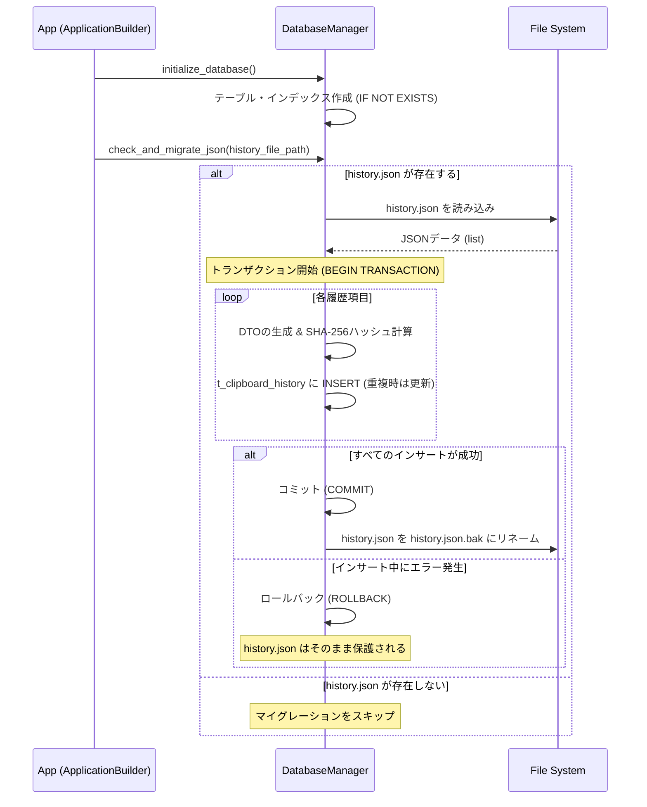
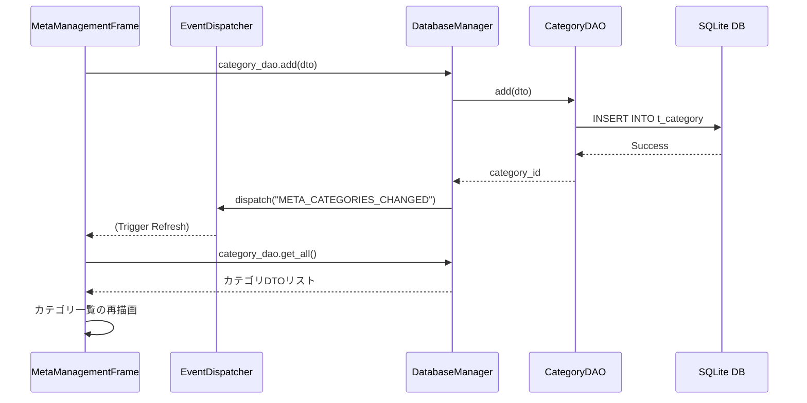
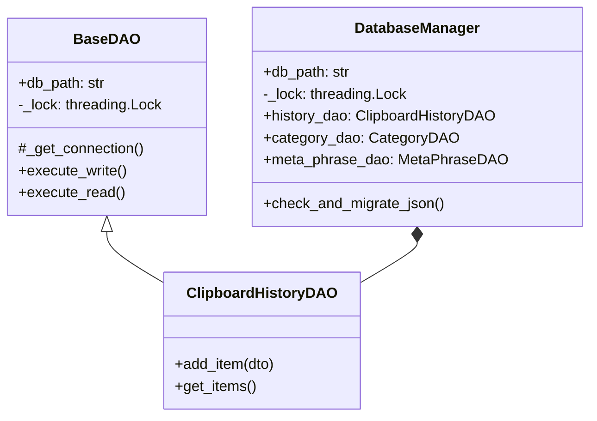

# メタ管理機能 & SQLite移行 詳細設計書

本ドキュメントは、Clip_Watcherにおける「クリップボード履歴データのSQLite完全移行」および「ユーザー定義カテゴリ付き定型文（メタ管理）タブの新設」に関する詳細設計・仕様書です。

---

## 1. データベース物理設計

SQLite データベースファイル（`clip_watcher.db`）内に以下の3つのテーブルを作成します。

### 1.1 `t_clipboard_history` (クリップボード履歴)
クリップボードから監視・収集した履歴データを保存します。

| 物理名         | 論理名             | データ型  | 制約                        | 説明                                                 |
| :------------- | :----------------- | :-------- | :-------------------------- | :--------------------------------------------------- |
| `id`           | 履歴ID             | `INTEGER` | `PRIMARY KEY AUTOINCREMENT` | 一意の識別子（UIやイベントではこの整数型IDに統一）   |
| `content`      | 履歴テキスト       | `TEXT`    | `NOT NULL`                  | コピーされたテキスト内容                             |
| `content_hash` | 重複排除用ハッシュ | `TEXT`    | `NOT NULL`                  | 重複判定用のSHA-256ハッシュ                          |
| `is_pinned`    | ピン留めフラグ     | `INTEGER` | `NOT NULL DEFAULT 0`        | `0`: 通常, `1`: ピン留め（自動クリーンアップ対象外） |
| `created_at`   | 作成日時           | `REAL`    | `NOT NULL`                  | 登録時のUnix Epoch時間 (`time.time()`)               |

- **インデックス**:
    - `idx_history_hash` ON `t_clipboard_history(content_hash)` (重複チェックの高速化)
    - `idx_history_created` ON `t_clipboard_history(created_at DESC)` (一覧取得・ソート用)

- **ID体系の変更に伴う整合性**:
    従来のコードで履歴の識別子として使われていた `float` 型のタイムスタンプ（`item_id`）は、今回のSQLite移行に伴い、自動生成される `id` (整数型) に**完全に置き換え・統合**します。UIコンポーネント（`HistoryListComponent`）やコマンド（`UpdateHistoryCommand`）も、すべてこの整数型 `id` を基準に動作するようリファクタリングします。

### 1.2 `t_category` (メタ管理カテゴリ)
ユーザーが定義する定型文の分類用カテゴリです。

| 物理名       | 論理名     | データ型  | 制約                        | 説明                       |
| :----------- | :--------- | :-------- | :-------------------------- | :------------------------- |
| `id`         | カテゴリID | `INTEGER` | `PRIMARY KEY AUTOINCREMENT` | 一意の識別子               |
| `name`       | カテゴリ名 | `TEXT`    | `NOT NULL UNIQUE`           | 重複を許容しないカテゴリ名 |
| `sort_order` | 表示順序   | `INTEGER` | `NOT NULL DEFAULT 0`        | UI上の表示並び順           |

### 1.3 `t_meta_phrase` (カテゴリ別定型文 - メタ管理)
カテゴリに紐づけられた定型文データです。

| 物理名        | 論理名     | データ型  | 制約                        | 説明                                         |
| :------------ | :--------- | :-------- | :-------------------------- | :------------------------------------------- |
| `id`          | メタ項目ID | `INTEGER` | `PRIMARY KEY AUTOINCREMENT` | 一意の識別子                                 |
| `title`       | タイトル   | `TEXT`    | `NOT NULL`                  | 一覧表示用のタイトル                         |
| `content`     | 定型文内容 | `TEXT`    | `NOT NULL`                  | コピー対象となるテキスト内容                 |
| `category_id` | カテゴリID | `INTEGER` | `NOT NULL`, `FOREIGN KEY`   | `t_category.id` への参照 (ON DELETE CASCADE) |
| `sort_order`  | 表示順序   | `INTEGER` | `NOT NULL DEFAULT 0`        | 同一カテゴリ内での表示並び順                 |
| `created_at`  | 作成日時   | `REAL`    | `NOT NULL`                  | 登録時のUnix Epoch時間                       |

- **インデックス**:
    - `idx_meta_phrase_category` ON `t_meta_phrase(category_id, sort_order)` (カテゴリ別フィルタ用)

---

## 2. マイグレーション（データ移行）処理フロー

アプリケーションの初回起動時またはDB初期化時に、既存の `history.json` から SQLite への自動データ移行を行います。安全性を極限まで高めるため、データ移行処理は必ず**単一のトランザクション**で実行します。



### 重複排除ロジック
移行および新規コピー登録時、`content_hash` （SHA-256）を用いて同一テキストの重複を防ぎます。
- 既に同一ハッシュの項目が存在する場合：
    - **ピン留め状態**: 元のピン留め状態と新規ピン留め状態を論理和 (OR) マージ。
    - **日時**: `created_at` を最新日時に更新し、履歴の最上位に移動させます。

---

## 3. UI/UX 設計

### 3.1 メタ管理タブ (`MetaManagementFrame`) のレイアウト

`tk.PanedWindow` を用いて、ウィンドウを左右に分割します。

```text
+-----------------------------------------------------------------------+
|  クリップボード履歴  |  定型文 (固定)  |  ★メタ管理 (新規)  |  設定...      |
+-----------------------------------------------------------------------+
|                                                                       |
|  +------------------------+  +-------------------------------------+  |
|  | カテゴリ一覧            |  | メタ定型文一覧 (カテゴリ: [選択中]) |  |
|  | +--------------------+ |  | +---------------------------------+ |  |
|  | | [すべて]           | |  | | タイトル       | 内容           | |  |
|  | | 開発用テンプレート | |  | | +--------------+----------------+ | |  |
|  | | メール定型文       | |  | | 署名           | 株式会社〇〇...| |  |
|  | | SQLクエリ          | |  | | 返信テンプレート| お世話に...    | |  |
|  | +--------------------+ |  | +---------------------------------+ |  |
|  |                        |  |                                     |  |
|  | [ 追加 ] [編集] [削除] |  | [コピー] [ 追加 ] [ 編集 ] [ 削除 ]  |  |
|  +------------------------+  +-------------------------------------+  |
|                                                                       |
+-----------------------------------------------------------------------+
```

1. **左側（カテゴリ管理）**:
    - `Listbox` を使用し、登録されているカテゴリを一覧表示。最上部には「[すべて] (All)」の特殊項目を表示。
    - 下部に「追加 (Add Category)」「編集 (Edit Category)」「削除 (Delete Category)」ボタンを配置。
2. **右側（メタ定型文管理）**:
    - `ttk.Treeview`（複数列表示）を使用し、選択されたカテゴリに属する定型文の `タイトル` と `内容（プレビュー）` を表形式で表示。
    - リストをダブルクリックした際、対象の定型文内容をクリップボードにコピーし、通知を表示。
    - 下部に「コピー (Copy)」「追加 (Add)」「編集 (Edit)」「削除 (Delete)」ボタンを配置。

### 3.2 ダイアログ設計

1. **カテゴリ作成/編集ダイアログ (`CategoryEditDialog`)**:
    - 単一の入力フィールド（カテゴリ名）を持つシンプルな `Toplevel` ウィンドウ。
    - バリデーション: 空白不可、重複不可。
2. **メタ定型文作成/編集ダイアログ (`MetaPhraseEditDialog`)**:
    - 入力フィールド:
        - `タイトル` (`CustomEntry`)
        - `カテゴリ` (`ttk.Combobox` - 登録済みのカテゴリから選択)
        - `内容` (`CustomText`)
    - バリデーション: タイトル・内容ともに空白不可。

---

## 4. イベント・データフロー

UI操作によるデータベースの変更は、すべて `DatabaseManager` の各種 DAO を通じて即時に永続化され、`EventDispatcher` により他のコンポーネントへ通知されます。



---

## 5. スレッドセーフ設計とロック制御

`ClipboardMonitor` のバックグラウンド監視スレッド（`monitor_thread`）と、メインUIスレッド（Tkinter GUI）の双方からデータベースに同時アクセスされるため、スレッド競合とデータベースロックの回避が必須です。

### 5.1 DAO / DTO パターンによる責務分離
本アプリケーションでは、保守性・堅牢性を最大化するために **DAO (Data Access Object)** と **DTO (Data Transfer Object)** のアーキテクチャを採用し、モジュールを `/src/db/` 配下に完全分離しています。

- **DTO (`src/db/dto.py`)**: SQLiteのレコード行データをカプセル化する Python Dataclasses。データの整合性保証（SHA-256ハッシュの自動生成等）を担当。
- **BaseDAO (`src/db/dao/base_dao.py`)**: `threading.Lock` を保持し、すべてのクエリ実行を排他制御ブロックで保護する共通の基底データアクセス層。
- **各種DAO (`src/db/dao/...`)**: 各テーブル専用のSQL構築およびDTOマッピング。
- **DatabaseManager (`src/db/database_manager.py`)**: 初期化、トランザクションマイグレーション、およびDAOインスタンスの生成・公開のみに集中。



### 5.2 `threading.Lock` によるクエリ排他制御 (`BaseDAO`)
SQLiteは同一接続インスタンスへの同時並行書き込みに制限があるため、`BaseDAO` においてクエリの同期化（`execute_write` と `execute_read` 内でのロック確保）を行っています。

```python
import threading
import sqlite3
from typing import Any


class BaseDAO:
    def __init__(self, db_path: str, lock: threading.Lock) -> None:
        self.db_path = db_path
        self._lock = lock

    def _get_connection(self) -> sqlite3.Connection:
        conn = sqlite3.connect(self.db_path)
        conn.execute("PRAGMA foreign_keys = ON")
        return conn

    def execute_write(self, query: str, params: tuple[Any, ...] = ()) -> int:
        with self._lock:  # マルチスレッド間での完全同期化
            with self._get_connection() as conn:
                cursor = conn.cursor()
                cursor.execute(query, params)
                conn.commit()
                return cursor.lastrowid or cursor.rowcount
```

### 5.3 コネクションプーリングの回避
接続を保持し続けると別スレッドから共有した際に ProgrammingError が発生するため、各クエリ実行時に `with sqlite3.connect(...)` を用い、都度オープン＆クローズを行う設計とします。

---

## 6. UIセーフガードとバリデーション

ユーザーの誤操作によるデータ消失を防ぐため、UIレベルとDBレベルの二重でセーフガードを設けます。

### 6.1 カテゴリ削除時の警告確認
`ON DELETE CASCADE` 制約により、カテゴリを削除すると紐づくすべての `t_meta_phrase` 項目がSQLiteによって自動削除されます。このデータ消失を防ぐため、以下のフローを実装します。

1. ユーザーがカテゴリ「開発用」の削除ボタンを押下。
2. `DatabaseManager.category_dao.get_meta_phrase_count(category_id)` を呼び出し、該当カテゴリに属する定型文の件数 `N` を確認。
3. `N > 0` の場合、Tkinter の `messagebox.askyesno` で警告を表示。
    - *表示メッセージ*: 「このカテゴリには `N` 件の定型文が登録されています。カテゴリを削除すると、これらの定型文もすべて削除されます。本当によろしいですか？」
4. ユーザーが「いいえ」を選択した場合は、処理を完全にキャンセルします。

### 6.2 ロギング仕様の徹底 (`RULE[user_global]`)
全てのデータベース例外、マイグレーション時のエラー、UI入力時の警告等は、標準出力への `print` 処理を一切排除し、ロガーを介して適切な重要度（`INFO`/`WARNING`/`ERROR`）で記録します。

```python
import logging

logger = logging.getLogger(__name__)

# 例: トランザクション失敗時のロールバック記録
logger.error(
    "マイグレーション処理中に例外が発生したためロールバックしました。: %s",
    str(e),
    exc_info=True,
)
```
