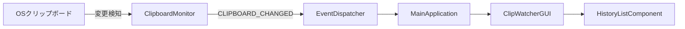

# 基本設計書（ClipWatcher全体アーキテクチャ）
**コンポーネント境界、イベント駆動、永続化方針の定義**

| 項目           | 内容                                    |
| :------------- | :-------------------------------------- |
| 文書番号       | CW-BD-001                               |
| ドキュメント名 | ClipWatcher全体アーキテクチャ基本設計書 |
| 版数           | Rev.1.0                                 |
| 改訂日         | 2026-08-31                              |
| 作成日         | 2026-08-31                              |
| 作成者         | 未記載                                  |

---

## 1. 概要と基本方針

ClipWatcherは、クリップボードの履歴をローカルで管理・再利用するデスクトップアプリケーションです。本書は主要コンポーネント、イベント駆動の連携、および責務境界を定義します。具体的な起動・監視・イベント制御は [CW-DD-002_コア層起動監視イベント制御詳細設計書.md](CW-DD-002_コア層起動監視イベント制御詳細設計書.md) を正本とします。

## 2. システム全体アーキテクチャとコンポーネント分離

### 2.1 全体構造

アプリケーションは、関心の分離と保守性向上のため、主に以下のディレクトリに分割されています。

-   `src/core/`: アプリケーションの中核機能（更に専門的なサブパッケージに細分化）。
    -   `bootstrap/`: アプリケーション起動処理、依存性注入（DI）、基本インターフェース（`ApplicationBuilder`, `BaseApplication`）。
    -   `clipboard/`: クリップボード監視ロジック（`ClipboardMonitor`）。
    -   `events/`: イベントディスパッチャおよびコマンドオブジェクト。
    -   `config/`: 設定管理および状態管理（`SettingsManager`, `AppStatus`）。
-   `src/db/`: データベースへのアクセス層（SQLite）。DAO（Data Access Object）とDTOパターンによるデータ操作を担当。
-   `src/services/`: データベース層とGUI層を仲介するビジネスロジック層（`HistoryService`, `FixedPhrasesManager` など）。
-   `src/gui/`: ユーザーインターフェース（UI）に関連するすべてのクラス。
-   `src/event_handlers/`: UIからのアクションをロジック層に結びつけるためのイベントハンドラ群。
-   `src/plugins/`: クリップボード内容の変換や、GUIツールを提供するための拡張プラグイン。
-   `src/utils/`: ログ設定やエラーハンドリングなど、アプリケーション全体で共有されるユーティリティ。

`clip_watcher.py` のエントリポイントから、`ApplicationBuilder` が各コンポーネントを組み立ててアプリケーションを構築します。

### 2.2 データフローの例

クリップボードの変更がUIに反映されるまでの基本的なデータフローは以下の通りです。

1.  `ClipboardMonitor` がOSのクリップボードの変更を検知します。
2.  `EventDispatcher` を通じて `CLIPBOARD_CHANGED` イベントを発行します。
3.  `MainApplication` クラスがイベントを受け取り、GUIの表示更新メソッドを呼び出します。
4.  GUIが `HistoryListComponent` などの関連コンポーネントの表示を更新します。

## 3. 主要コンポーネントとサービス

| クラス / サービス    | 説明                                                                              |
| :------------------- | :-------------------------------------------------------------------------------- |
| `MainApplication`    | すべてのコンポーネントを保持し、全体を統括するメインクラス。                      |
| `ApplicationBuilder` | 依存関係を解決しながら `MainApplication` のインスタンスを生成するビルダークラス。 |
| `EventDispatcher`    | Pub/Sub パターンを実装し、コンポーネント間の疎結合な通信を実現するイベントバス。  |
| `DatabaseManager`    | SQLite データベースへの接続とトランザクション管理を行う。                         |
| `HistoryService`     | 履歴データのCRUD操作をカプセル化するビジネスロジック層。                          |
| `UndoManager`        | コマンドパターンを利用して、元に戻す（Undo）/やり直し（Redo）の操作を管理する。   |
| `PluginManager`      | プラグイン（テキスト変換、GUIツール）を動的に読み込み管理する。                   |

## 4. GUI レイヤー

`src/gui` ディレクトリは、ユーザーインターフェース要素を含みます。

-   **`ClipWatcherGUI`**: メインウィンドウ。クリップボードタブ、メタ管理タブ（定型文など）、プラグインから動的に読み込まれるツールタブを持つ。
-   **`components/`**: `HistoryListComponent` や `PhraseListComponent` など、再利用可能なUI部品。
-   **`dialogs/`** および **`windows/`**: 各種設定やメタ管理、ポップアップダイアログ。
-   **`base/context_menu.py`**: 右クリックメニューのロジック。状態管理（StateProvider）をUIから分離。
-   **`ThemeManager`**: `ttk` スタイルと標準の `tk` ウィジェットにテーマ（ライト/ダーク）を一元的に適用する。

## 5. イベント駆動アーキテクチャ

コンポーネント間の通信は、`EventDispatcher` を介したイベントの送受信によって行われます。

### 主要なイベント例

| イベント名                 | ペイロード    | 発行元 (例)          | 購読者 (例)            | 説明                                               |
| :------------------------- | :------------ | :------------------- | :--------------------- | :------------------------------------------------- |
| `SETTINGS_CHANGED`         | `dict`        | `SettingsManager`    | `MainApplication`      | 設定が変更されたことを通知する。                   |
| `CLIPBOARD_CHANGED`        | `str`         | `ClipboardMonitor`   | `MainApplication`      | クリップボードの内容が変更されたことを通知する。   |
| `HISTORY_COPY_SELECTED`    | `list[float]` | コンテキストメニュー | `HistoryEventHandlers` | 選択項目のコピーを要求する。                       |
| `REQUEST_UNDO_LAST_ACTION` | `None`        | コンテキストメニュー | `HistoryEventHandlers` | `UndoManager` を介して元に戻す操作をトリガーする。 |

## 6. コマンドパターン (Undo/Redo)

元に戻す/やり直し機能は、コマンドパターンを用いて実装されています。
-   **`UpdateHistoryCommand`**: 履歴項目の編集やフォーマットなど、状態を変更する操作をコマンドオブジェクトとしてカプセル化。
-   **`UndoManager`**: 実行されたコマンドをスタックに保持し、`undo()` 呼び出しで状態を元に戻す。

## 7. プラグインシステム

`src/plugins` 以下のプラグインは `BasePlugin` を継承し、`PluginManager` により動的に読み込まれます。

1. **テキスト処理プラグイン**: クリップボードテキストを変換する機能（例: 大文字変換、単位変換など）。
2. **GUIツールプラグイン**: アプリケーションに自己完結した新しい機能タブを追加する（`has_gui_component() -> True`）。

## 8. データ永続化 (SQLite & JSON)

ユーザーのデータと設定は、OSごとのユーザーディレクトリ配下に永続化されます。

-   **保存場所**: Windowsでは `%USERPROFILE%\.clipWatcher\`、その他のOSでは `~/.clipwatcher/`
-   **SQLite データベース** (`clip_watcher.db`):
    -   履歴データ、メタ管理データ（カテゴリ、タグ付き定型文）などの永続化に使用します。
-   **JSON ファイル**:
    -   `history.json`: 既存履歴の保存・SQLite移行に使用します。
    -   `settings.json`: アプリケーションの全般的な設定を保存します。リポジトリ直下の同名ファイルは開発用の例であり、実行時には上記のユーザーディレクトリにあるファイルを使用します。

## 9. 改訂履歴

| 版数    | 改訂日     | 変更者 | 変更内容・変更理由 (Why)                                                                  |
| :------ | :--------- | :----- | :---------------------------------------------------------------------------------------- |
| Rev.1.0 | 2026-08-31 | 未記載 | アーキテクチャ概要を基本設計書として命名・分類し、メタデータ、Mermaid図、改訂履歴を整備。 |
