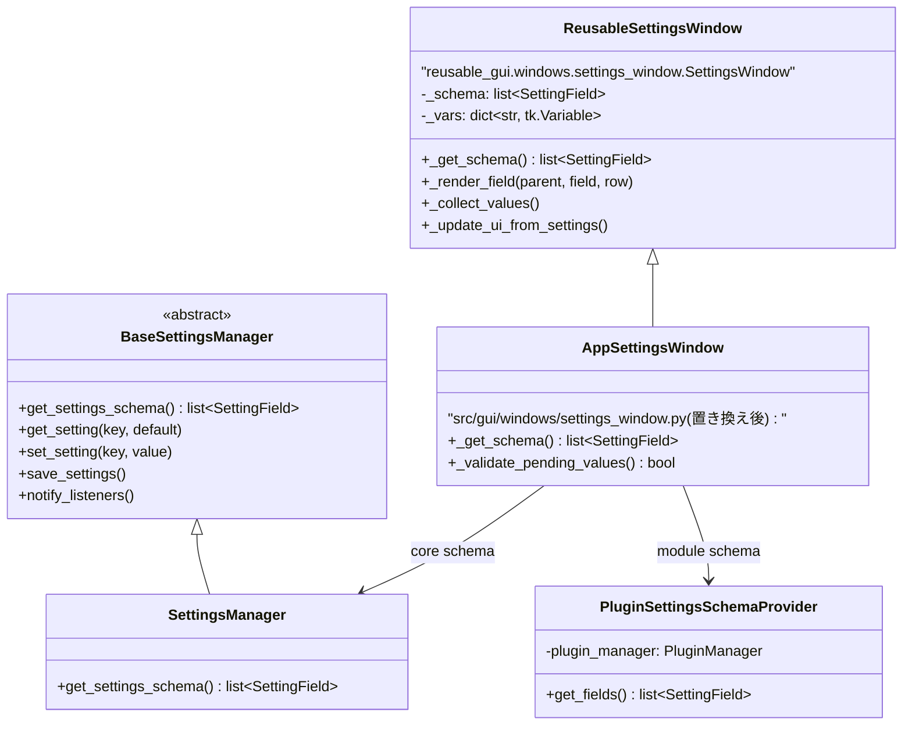
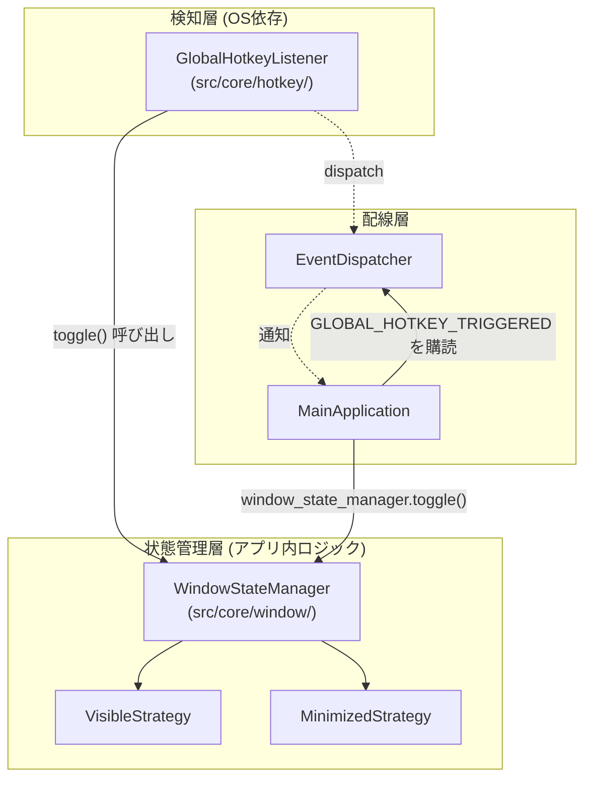
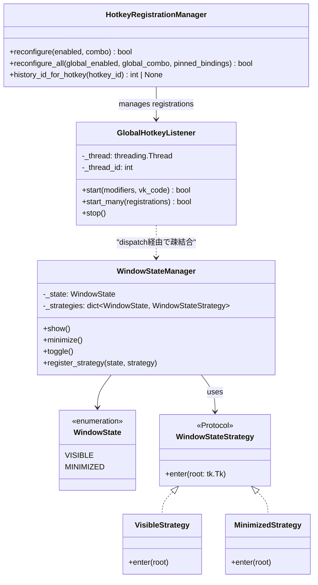
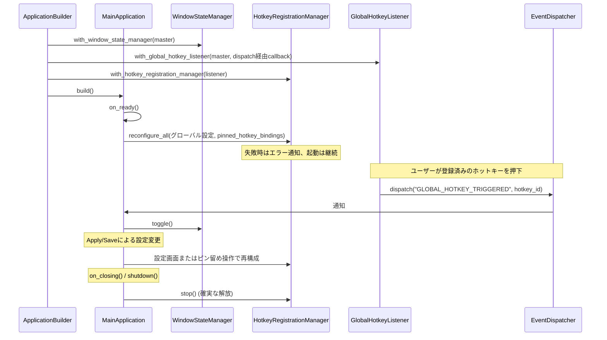

# 詳細設計書（設定画面スキーマ駆動化とグローバルホットキー連携）
**設定画面のスキーマ駆動化、ウィンドウ状態管理、ホットキー集合登録の制御仕様**

| 項目           | 内容                                                       |
| :------------- | :--------------------------------------------------------- |
| 文書番号       | CW-DD-001                                                  |
| ドキュメント名 | 設定画面スキーマ駆動化とグローバルホットキー連携詳細設計書 |
| 版数           | Rev.1.0                                                    |
| 改訂日         | 2026-08-31                                                 |
| 作成日         | 2026-08-18                                                 |
| 作成者         | 未記載                                                     |

---

## 1. 概要とSSOT境界

### 1.1 目的
1. 現在手書きで実装されている `src/gui/windows/settings_window.py` を、
   スキーマ駆動（`SettingField` + 汎用レンダラー）方式に置き換える。
2. その基盤の上に、グローバルホットキー（デフォルト: `Ctrl+Shift+F`）による
   ウィンドウの「表示 ⇔ 最小化」トグル機能を追加する。
3. 将来のタスクバー最小化・トレイ格納などの追加状態を、既存コードへの
   変更を最小限にして組み込めるクラス設計にする。

### 1.2 背景・現状の課題
- `src/gui/windows/settings_window.py` は設定項目1つにつき
  「変数宣言 → ウィジェット生成 → 保存処理 → 復元処理」の4箇所を
  手動で同期する必要があり、項目追加時の記述量と不整合リスクが大きい。
- `reusable_gui/` 配下には、`SettingField` のリスト（スキーマ）のみから
  UIを動的生成する汎用実装（`reusable_gui/windows/settings_window.py`）が
  既に存在するが、アプリ側 (`src/`) からは未使用。
- ホットキー機能・ウィンドウ状態管理・システムトレイ常駐は、いずれも
  「OS依存の検知処理」と「アプリ内の状態遷移」という2層構造を持つ点で
  共通しており、今回はこの2層を明確に分離した設計とする。
- 標準ライブラリ（`tkinter`, `ctypes`, `threading`）のみで実装する方針。
  `pywin32` は既存依存（クリップボード監視のフォールバック用途）を
  超えて新たに使用しない。

---

## 2. スコープとSSOT境界

### 2.1 対応する変更
- `src/gui/windows/settings_window.py` を `reusable_gui/windows/settings_window.py`
  ベースの薄いサブクラスに置き換える。
- `src/core/config/settings_manager.py` の `get_settings_schema()` を、
  コア設定の唯一の定義（source of truth）とする。
- プラグイン由来の `Modules` タブを、`PluginSettingsSchemaProvider` による
  動的スキーマとして正式にスコープへ含める。
- `reusable_gui/core/config/schema.py` の `WidgetType` に
  `HOTKEY_CAPTURE` を追加する。
- 新設: `src/core/hotkey/` （グローバルホットキー検知・登録状態の管理）
- 新設: `src/core/window/` （ウィンドウ表示状態管理）
- `SettingsManager` のデフォルト設定に `global_hotkey_enabled`,
  `global_hotkey_combo`, `pinned_hotkey_bindings` を追加する。
- 表示/最小化キー（予約ID `1`）と、ピン留め履歴に割り当てる複数キー
  （ID `2` 以降）を、同じ登録集合として管理する。
- `ApplicationBuilder` / `MainApplication` へのライフサイクル組み込み。

### 2.2 対応しない変更（別スコープ）
- システムトレイ常駐の実際の実装（`WindowState` の拡張余地のみ確保）。
- 設定画面のUIデザイン刷新（レイアウト・配色は既存のまま踏襲）。
- 現在UI生成コードがコメントアウトされ、実運用で機能していない
  「設定画面タブの表示切替」 (`show_*_settings_tab`) の再有効化または削除。
  既存の設定値は後方互換のため保持するが、移行後のスキーマには含めず、
  新たなUIも提供しない。整理方針は将来別要件として決定する。

---

## 3. 設定画面のスキーマ駆動化 詳細仕様

### 3.1 現状構成と移行後構成の比較

| 項目               | 現状 (`src/gui/windows/settings_window.py`) | 移行後                                                                                                     |
| :----------------- | :------------------------------------------ | :--------------------------------------------------------------------------------------------------------- |
| 設定項目の定義場所 | `__init__` 内の `tk.Variable` 宣言に散在    | コア設定は `SettingsManager.get_settings_schema()`、プラグイン設定は `PluginSettingsSchemaProvider` に分離 |
| UI生成             | `_create_widgets()` に手書きgridレイアウト  | `reusable_gui` 側 `_render_field()` が `WidgetType` に応じて自動生成                                       |
| 保存処理           | `_save_settings_logic()` に手動列挙         | `_collect_values()` が合成済みスキーマを走査して自動収集                                                   |
| 復元処理           | `_update_ui_from_settings()` に手動列挙     | 合成済みスキーマの走査により自動復元                                                                       |
| Modulesタブ        | 個別の `tool_tab_vars` を手動構築           | GUIプラグイン一覧から `SettingField` を動的生成                                                            |
| クラス階層         | `BaseToplevelGUI` を直接継承                | `reusable_gui.windows.settings_window.SettingsWindow` を継承した薄いラッパー                               |

### 3.2 クラス設計



- `AppSettingsWindow` は `ReusableSettingsWindow` を継承する薄いクラスとし、
  テーマ適用・翻訳・スキーマ合成・保存前検証だけを担当する。
- `ReusableSettingsWindow` は、既存の直接
  `settings_manager.get_settings_schema()` 呼び出しを保護メソッド
  `_get_schema()` に置き換える。既定実装はコアスキーマを返し、
  `AppSettingsWindow` がコアスキーマとプラグインスキーマを合成する。
- `WidgetType.HOTKEY_CAPTURE` のレンダリングは `reusable_gui` 側に
  汎用実装として追加する。ホットキーの登録可否というアプリ固有処理は
  `AppSettingsWindow._validate_pending_values()` に閉じ込める。

### 3.3 Modulesタブのスキーマ合成

`SettingsManager` は `PluginManager` に依存せず、コア設定だけの定義を保持する。`PluginSettingsSchemaProvider` がGUIプラグインからModulesタブ用の `SettingField` を生成し、`AppSettingsWindow` がコア設定スキーマと合成する。

| 要素                              | 入力                                     | 出力・契約                                                     |
| :-------------------------------- | :--------------------------------------- | :------------------------------------------------------------- |
| `PluginSettingsSchemaProvider`    | `PluginManager` が返すGUIプラグイン      | プラグインごとに `show_{plugin}_tab` キーを持つ `SettingField` |
| `AppSettingsWindow._get_schema()` | コア設定スキーマ、プラグイン設定スキーマ | 両方を結合した設定画面用スキーマ                               |

この分離により、GUIプラグインの追加・削除はModulesタブの設定項目に自動追従し、設定管理層とプラグイン管理層の直接結合を防ぐ。

### 3.4 移行手順

1. **`SettingsManager` を `BaseSettingsManager` に適合させる**
   - `src/core/config/settings_manager.py` の `SettingsManager` が
     `reusable_gui.core.config.settings_manager.BaseSettingsManager` を
     継承するように変更する。
2. **コアスキーマを完全化する**
   - General/History/Notifications/Font/Excluded Apps/Hotkey の全項目を
     `SettingsManager.get_settings_schema()` に列挙する。
3. **`PluginSettingsSchemaProvider` を追加する**
   - `PluginManager.get_gui_plugins()` を基に `Modules` タブの
     `show_{plugin}_tab` 項目を動的生成する。
4. **`ReusableSettingsWindow` を拡張する**
   - `_get_schema()` と保存前フック `_validate_pending_values()` を追加する。
   - `_apply_only()` / `_save_and_close()` は、検証に成功した場合のみ
     `_collect_values()` と通知・保存を実行する。
5. **`AppSettingsWindow` を新規作成し、既存 `SettingsWindow` を置き換える**
   - `src/gui/windows/settings_window.py` の内容を全面差し替える。
   - `_get_schema()` でコア・Modulesスキーマを合成する。
   - テーマ適用と翻訳キー対応をフックする。
6. **`app_main.py` の `open_settings_window()` は変更不要**
   - `self.create_toplevel(SettingsWindow, self.settings_manager)` の
     呼び出し口は変わらない。

### 3.5 影響範囲の確認

| 呼び出し元                                     | 現状の依存内容                                   | 変更後の影響                                        |
| :--------------------------------------------- | :----------------------------------------------- | :-------------------------------------------------- |
| `src/core/app_main.py: open_settings_window()` | `SettingsWindow(master, self, settings_manager)` | 変更なし（コンストラクタ互換）                      |
| `src/gui/main_gui.py`                          | `show_{plugin}_tab` でGUIプラグインのタブを制御  | 変更なし。Modulesスキーマが既存キーを生成・保存する |
| `src/core/bootstrap/application_builder.py`    | 未参照                                           | 影響なし                                            |
| `settings.json` の保存形式                     | `dict[str, Any]`                                 | 変更なし。既存の `show_{plugin}_tab` 値を継承する   |

---

## 4. グローバルホットキー機能 詳細仕様

### 4.1 要件
- デフォルトキー: `Ctrl+Shift+F`
- 動作: トリガー時にウィンドウの「表示 ⇔ 最小化」をトグルする。
- タスクバーの最小化ボタンなど、OS操作による状態変化にも追従する。
- 将来、トレイ格納などの追加状態を既存コード変更なしで組み込める設計とする。
- キー競合時は起動を継続し、ログとエラーダイアログで通知する
  （§4.6参照）。

### 4.2 レイヤー構成



- `GlobalHotkeyListener` は「キー入力を検知して通知する」以外の責務を持たない。
- `WindowStateManager` は「今どの状態か」「状態が変わったら何をするか」を
  `WindowState` (Enum) と `WindowStateStrategy` (Protocol) の組み合わせで
  一元管理する。
- 両者の間には直接依存を作らず、`EventDispatcher` の
  `GLOBAL_HOTKEY_TRIGGERED` イベントを介して疎結合に接続する
  （既存アーキテクチャの Pub/Sub 方針に合わせる）。

### 4.3 クラス設計



### 4.4 ファイル配置

```text
src/core/
├── hotkey/
│   ├── __init__.py
│   ├── global_hotkey_listener.py    # Listener, HotkeyRegistration, キー文字列変換
│   ├── hotkey_registration_manager.py # 集合検証・ID採番・失敗時復元
│   └── paste_sender.py              # WindowsPasteSender
└── window/
    ├── __init__.py
    └── window_state_manager.py      # WindowState, WindowStateStrategy, WindowStateManager
```

- `hotkey/` は `clipboard/` と同じOS監視インフラの層に置き、キー入力の検知、集合登録、入力送信をUI状態管理から分離する。
- `window/` はアプリのUI状態管理として独立させ、将来トレイ格納の
  `TrayHiddenStrategy` 等を追加する際もこのパッケージ内に収める。

### 4.5 実装詳細

#### 4.5.1 `WindowState` / `WindowStateManager`

`WindowStateManager` はメインウィンドウの表示状態を保持し、状態ごとのUI操作をStrategyとして分離する。

| 操作                                 | 事前条件                                | 結果・事後条件                                      |
| :----------------------------------- | :-------------------------------------- | :-------------------------------------------------- |
| `show()`                             | なし                                    | 状態を `VISIBLE` にし、ウィンドウを表示・前面化する |
| `minimize()`                         | なし                                    | 状態を `MINIMIZED` にし、ウィンドウを最小化する     |
| `toggle()`                           | 現在状態が `VISIBLE` または `MINIMIZED` | 2状態を相互に遷移させる                             |
| `register_strategy(state, strategy)` | 有効な状態とStrategy                    | 指定状態の遷移処理を置き換える                      |

`<Unmap>` と `<Map>` のイベントはOS操作による最小化・表示を状態に反映する。未定義の状態への遷移要求は警告を記録し、ウィンドウ操作を行わない。

#### 4.5.2 `GlobalHotkeyListener` とキー文字列変換

`GlobalHotkeyListener` は、登録ID・修飾キー・仮想キーコードからなる `HotkeyRegistration` の集合を単一のWindowsメッセージスレッドで処理する。表示/最小化キーの予約IDは `1`、ピン留め履歴キーのIDは `2` から採番する。

| API                         | 入力                        | 結果・失敗契約                                                                           |
| :-------------------------- | :-------------------------- | :--------------------------------------------------------------------------------------- |
| `start(modifiers, vk_code)` | 単一の表示/最小化キー       | 予約ID `1` を用いて `start_many()` へ委譲する互換API                                     |
| `start_many(registrations)` | `HotkeyRegistration` の集合 | 重複IDを拒否する。登録途中で失敗した場合は、同一スレッドで登録済みの全IDを逆順に解除する |
| `stop()`                    | なし                        | メッセージループを停止し、登録済みの全IDを解除する                                       |

`WM_HOTKEY` の通知には登録IDを付与し、`tk_root.after()` を介してメインスレッドへ渡す。キー文字列は `parse_hotkey_string()` と `format_hotkey()` で正規化し、`Ctrl`、`Alt`、`Shift`、`Win` と英数字の主キーを受け付ける。

`HotkeyRegistrationManager.reconfigure_all(global_enabled, global_combo, pinned_bindings)` は候補集合を検証・登録する。表示/最小化キーとピン留めキーの重複を拒否し、失敗時は旧集合を復元する。`history_id_for_hotkey()` により、アプリケーション層はWin32の登録詳細を持たずにピン留め履歴を特定できる。

### 4.6 設定への統合

#### 4.6.1 設定項目

| 設定キー                 | 型               | 既定値         | 用途                                       |
| :----------------------- | :--------------- | :------------- | :----------------------------------------- |
| `global_hotkey_enabled`  | `bool`           | `True`         | 表示/最小化キーの有効状態                  |
| `global_hotkey_combo`    | `str`            | `Ctrl+Shift+F` | 表示/最小化キーの正規化済み文字列          |
| `pinned_hotkey_bindings` | `dict[str, str]` | `{}`           | 履歴ID文字列からピン留めキー文字列への対応 |

#### 4.6.2 設定画面スキーマ

`global_hotkey_enabled` はチェックボックス、`global_hotkey_combo` は `HOTKEY_CAPTURE` により入力する。いずれもGeneralタブのGlobal Hotkeyグループに配置する。`HOTKEY_CAPTURE` は修飾キー単独では値を確定せず、`Ctrl`、`Alt`、`Shift`、`Win` と英数字から正規化済みの文字列を生成する。競合検証・登録・エラー表示は、UI部品ではなく保存時のアプリケーション層が担当する。

#### 4.6.3 `WidgetType.HOTKEY_CAPTURE`

`HOTKEY_CAPTURE` はホットキー文字列を保持する設定UIの種別である。編集用Entryは直接入力を受け付けず、フォーカス中のキー入力から正規化済みのキー文字列を生成する。テスト登録ボタンは設けず、競合確認はApply/Save時の登録成否だけを正とする。

#### 4.6.4 Apply/Save時の検証と登録

UIは `GlobalHotkeyListener` の低水準APIを直接呼び出さず、`HotkeyRegistrationManager` を経由して登録状態を変更する。

| API                                                              | 用途                                     | 成功時                                                 | 失敗時                               |
| :--------------------------------------------------------------- | :--------------------------------------- | :----------------------------------------------------- | :----------------------------------- |
| `reconfigure(enabled, combo)`                                    | 表示/最小化キーの変更                    | 現在のピン留め割当を維持して再構成する                 | 旧集合を維持し、設定を保存しない     |
| `reconfigure_all(global_enabled, global_combo, pinned_bindings)` | ピン留め割当の設定・変更・解除・一括解除 | 候補集合を原子的に適用し、成功後に設定と一覧を更新する | 旧集合を復元し、割当と表示を維持する |

両APIはキー書式と集合内の重複を検証してから登録する。`pinned_hotkey_bindings` は履歴IDの文字列をキー、正規化済みキー文字列を値として永続化する。

### 4.7 アプリライフサイクルへの組み込み



#### 4.7.1 `ApplicationBuilder` への追加

| ビルダー操作                          | 生成物                      | 配線契約                                         |
| :------------------------------------ | :-------------------------- | :----------------------------------------------- |
| `with_window_state_manager(master)`   | `WindowStateManager`        | メインウィンドウの状態遷移を管理する             |
| `with_global_hotkey_listener(master)` | `GlobalHotkeyListener`      | `GLOBAL_HOTKEY_TRIGGERED` イベントへ登録IDを渡す |
| `with_hotkey_registration_manager()`  | `HotkeyRegistrationManager` | Listenerの集合登録と失敗時復元を管理する         |

`build()` はこれらを `MainApplication` へ注入する。イベントディスパッチャが未初期化の場合、Listenerの構築は設定エラーとして失敗する。

#### 4.7.2 `MainApplication` への追加

- `on_ready()` は、設定値を正規化したピン留め割当とともに `_reconfigure_hotkeys_from_settings()` で登録する。登録に失敗しても、エラーを表示してアプリケーションの起動は継続する。
- `GLOBAL_HOTKEY_TRIGGERED` は登録IDを伴う。予約ID `1` は `WindowStateManager.toggle()` を呼び、ピン留めIDは `history_id_for_hotkey()` で履歴IDへ変換して、クリップボード更新・通知音・75ms後の `WindowsPasteSender` による貼り付けを行う。
- ピン留め割当の設定・変更・解除・一括解除は、再構成成功後だけ `pinned_hotkey_bindings` を保存し、履歴一覧を更新する。ピン解除、履歴削除、全履歴削除時も対応する割当を解除する。
- `shutdown()` は `HotkeyRegistrationManager.stop()` を呼び、登録済みの全IDを解除する。

### 4.8 エラー処理・失敗契約

| ケース                         | 挙動                                                                                                                                 |
| :----------------------------- | :----------------------------------------------------------------------------------------------------------------------------------- |
| 起動時に登録集合が競合         | `reconfigure_all()` が `False` を返す。ログwarning出力とエラーダイアログ表示後、アプリは起動を継続し、ホットキー機能のみ無効にする。 |
| Apply/Save時に新しいキーが競合 | エラーを表示してApply/Saveを中止する。候補設定は `settings.json` に保存せず、可能な限り従来の有効なホットキー登録を維持・復元する。  |
| 不正なキー形式                 | エラーを表示してApply/Saveを中止する。既存設定・登録状態を変更しない。                                                               |
| アプリ終了時                   | `shutdown()` で必ず `UnregisterHotKey` を実行し、他アプリが同キーを登録できる状態に戻す。                                            |

---

## 5. 影響を受けるファイル一覧

| ファイル                                                 | 変更種別                                                                                      |
| :------------------------------------------------------- | :-------------------------------------------------------------------------------------------- |
| `src/gui/windows/settings_window.py`                     | 全面置き換え（`reusable_gui` 版継承、スキーマ合成・保存前検証）                               |
| `src/core/config/settings_manager.py`                    | `BaseSettingsManager` 継承化、コアスキーマ拡充                                                |
| `src/core/config/defaults.py`                            | `global_hotkey_*` デフォルト値追加                                                            |
| `src/plugins/settings_schema_provider.py`（新規）        | GUIプラグイン由来のModulesスキーマ生成                                                        |
| `reusable_gui/core/config/schema.py`                     | `WidgetType.HOTKEY_CAPTURE` 追加                                                              |
| `reusable_gui/windows/settings_window.py`                | `_get_schema()`、`_validate_pending_values()` フック、`HOTKEY_CAPTURE` のレンダリング処理追加 |
| `src/core/hotkey/__init__.py`（新規）                    | 追加                                                                                          |
| `src/core/hotkey/global_hotkey_listener.py`（新規）      | OSホットキーの検知、キー文字列変換                                                            |
| `src/core/hotkey/hotkey_registration_manager.py`（新規） | 集合検証、ID採番、登録切替、失敗時の復元                                                      |
| `src/core/hotkey/paste_sender.py`（新規）                | アクティブウィンドウへの `Ctrl+V` 送信                                                        |
| `src/core/window/__init__.py`（新規）                    | 追加                                                                                          |
| `src/core/window/window_state_manager.py`（新規）        | ウィンドウ状態遷移とStrategy管理                                                              |
| `src/core/bootstrap/application_builder.py`              | Hotkey・Window関連コンポーネントのビルドステップ追加                                          |
| `src/core/app_main.py`                                   | ライフサイクル・イベント購読・依存性受け取り追加                                              |
| `locales/en.json` / `locales/ja.json`                    | ホットキー設定、Modulesタブのラベル翻訳キー追加                                               |

---

## 6. テスト・検証要件

1. **単体テスト（`pytest`）**
   - `parse_hotkey_string` / `format_hotkey` の相互変換（正常系・異常系）。
   - `WindowStateManager` の状態遷移（`show()` → `VISIBLE`、
     `minimize()` → `MINIMIZED`、`toggle()` の往復）。
   - `HotkeyRegistrationManager` の再構成判断（無効化、同一設定、
     競合時に既存設定を維持すること）をモックで検証。
   - `SettingsManager.get_settings_schema()` が全コア設定と
     `HOTKEY_CAPTURE` 項目を含むことの検証。
   - `PluginSettingsSchemaProvider` がGUIプラグインごとに
     `show_{plugin}_tab` の `SettingField` を生成することの検証。
2. **手動確認（OS依存のため）**
   - デフォルトキーでウィンドウの表示/最小化がトグルすることを確認。
   - タスクバーの最小化ボタン操作後にホットキーを押し、状態追従を確認。
   - 別プロセスで同じキーを登録した状態で起動し、競合エラーダイアログが
     出ることを確認。
   - 設定画面でキー組み合わせを変更してApply/Saveした際、競合なら
     設定が保存されず旧キーが継続することを確認。
   - 競合しない変更では、旧キーが反応せず新キーが反応することを確認。
   - GUIプラグインの表示切替がModulesタブに表示され、保存・再起動後も
     `ClipWatcherGUI` のタブ状態に反映されることを確認。
   - アプリ終了後、同じキーが他アプリで登録可能になっていることを確認。
3. **既存機能への影響確認**
   - 設定画面の全タブ（General/History/Notifications/Font/Excluded Apps/Modules）
     が移行後も同じ項目を保存・復元できることを回帰確認。
   - `Export/Import/Restore Defaults` ボタンが従来通り動作することを確認。
   - 既存の `settings.json` に含まれる `show_{plugin}_tab` 値を読み込んだ場合も、
     Modulesタブとメイン画面の表示状態へ正しく反映されることを確認。

---

## 7. 確定事項

- デフォルトのグローバルホットキーは `Ctrl+Shift+F` とする。
- 表示/最小化キーには予約ID `1` を使用し、ピン留め履歴キーはID `2` 以降を使用する。
- ピン留め履歴の割当は `pinned_hotkey_bindings` に保存し、重複キーを拒否する。登録失敗時は旧集合を復元し、終了時は全IDを解除する。
- ホットキーの動作は、予約IDではメインウィンドウの表示/最小化トグル、ピン留めIDでは対象履歴の自動貼り付けとする。
- `HOTKEY_CAPTURE` ウィジェットにはテスト登録ボタンを設けない。
  競合検証・登録切替はApply/Save時に `HotkeyRegistrationManager` の
  単一経路で実施し、失敗時は設定を保存しない。
- `Modules` タブは本改造のスコープに含め、
  `PluginSettingsSchemaProvider` による動的スキーマとして実装する。
- システムトレイ常駐は本改造では実装しない。ただし、
  `WindowState` と `WindowStateStrategy` の拡張で将来追加可能な構造にする。

## 8. 将来の検討事項（本改造では対応不要）

- **トレイ格納状態**: スコープ外であり、トレイアイコンやWndProcを含む実装は
  行わない。将来 `HIDDEN_TO_TRAY` と `TrayHiddenStrategy` を追加できるよう、
  `WindowState` / `WindowStateStrategy` の拡張点だけを維持する。
- **`show_*_settings_tab` の扱い**: 現在はUIとして提供されず、
  実行時にも利用されていない休眠設定である。今回ただちに削除する必要はない。
  既存の `settings.json` 値と `defaults.py` のキーは後方互換のため残し、
  スキーマおよび新設定画面には表示しない。将来、正式な設定画面タブ切替を
  要求する場合はスキーマ化し、不要と決定した場合は設定ファイル移行を伴う
  段階的な廃止を行う。
---

## 9. 改訂履歴

| 版数    | 改訂日     | 変更者 | 変更内容・変更理由 (Why)                                                                   |
| :------ | :--------- | :----- | :----------------------------------------------------------------------------------------- |
| Rev.1.0 | 2026-08-31 | 未記載 | 文書を詳細設計書として命名・分類し、テンプレート準拠のメタデータ、設計契約、改訂履歴へ整形 |