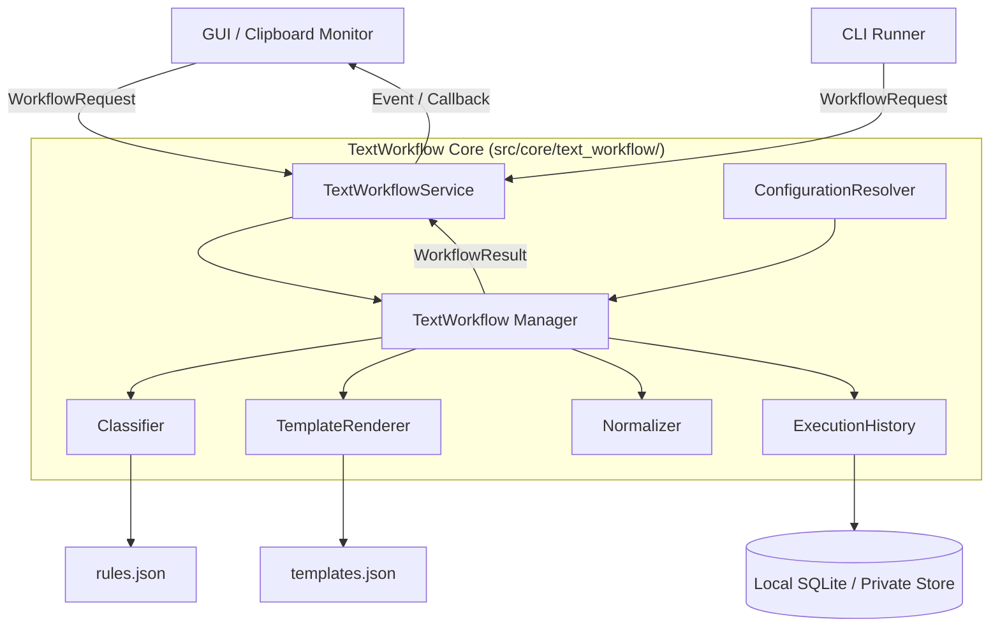

# 詳細設計書（TextWorkflow）
**テキスト分類、テンプレート展開、正規化、実行履歴の制御仕様**

| 項目           | 内容                   |
| :------------- | :--------------------- |
| 文書番号       | CW-DD-003              |
| ドキュメント名 | TextWorkflow詳細設計書 |
| 版数           | Rev.1.0                |
| 改訂日         | 2026-08-31             |
| 作成日         | 2026-08-31             |
| 作成者         | 未記載                 |

---

## 1. 概要とSSOT境界

本設計書は、Clip_Watcher 内でクリップボードテキストまたは明示入力テキストを構造的に分類し、テンプレート展開・テキスト正規化を行い、その結果と実行履歴を安全に記録・返却する Python 製テキスト処理基盤 (`TextWorkflow`) の仕様・設計を定義する。

外部ツールへの依存を排し、Python の標準ライブラリおよび Clip_Watcher の既存コンポーネント (`ApplicationBuilder`, `EventDispatcher`, `HistoryService`) と柔軟かつ安全に接続可能なモジュール群として設計する。

### 1.1 スコープ

- **テキスト分類 (Classifier)**: ルール (正規表現、キーワード、テキスト長等) による自動カテゴリ判定。
- **テンプレート展開 (TemplateRenderer)**: 安全な変数埋め込み (`{{input}}`, `{{date}}` 等) による動的テキスト生成。
- **テキスト正規化 (Normalizer)**: 改行コード統一、末尾空白トリム、Unicode正規化等の前処理・後処理。
- **設定レイヤー合成 (ConfigurationResolver)**: 組み込み・ユーザー設定・ワークスペース設定・実行時オーバーライドの階層マージ。
- **専用実行履歴 (ExecutionHistory)**: 既存のクリップボード履歴とは独立した Workflow 実行結果の保存。
- **Clip_Watcher 統合**: GUI/イベント駆動による非同期実行 seam の提供。

### 1.2 非スコープ
- クライアント・サーバー間通信やクラウド同期機能。
- 任意の Python コード/シェルコマンドの動的評価・実行。

---

## 2. アーキテクチャ (Architecture)



`TextWorkflow` は分類・展開・正規化・履歴記録の順序制御と失敗分離をカプセル化するディープモジュールとする。呼び出し側は単一の `WorkflowRequest` を渡し、`WorkflowResult` を受け取るのみで完結する。

---

## 3. インターフェースとDTO仕様

TextWorkflowは、分類・展開・正規化・履歴記録の順序制御と失敗分離をカプセル化するディープモジュールです。呼び出し側は次の入力DTOを渡し、出力DTOを受け取ります。

### 3.1 列挙値と分類DTO

| DTO / 列挙        | フィールドまたは値                                             | 型            | 制約・意味                                     |
| :---------------- | :------------------------------------------------------------- | :------------ | :--------------------------------------------- |
| `SourceKind`      | `EXPLICIT_TEXT` / `CLIPBOARD`                                  | enum          | 入力元が明示テキストかクリップボードかを表す。 |
| `ExecutionStatus` | `COMPLETED` / `COMPLETED_WITH_WARNING` / `REJECTED` / `FAILED` | enum          | 実行の終端状態を表す。                         |
| `Classification`  | `category_id`                                                  | string        | 分類されたカテゴリ識別子。                     |
| `Classification`  | `matched_rule_id`                                              | string / null | 適用されたルールの識別子。                     |
| `Classification`  | `confidence`                                                   | number        | 分類確度。既定値は `1.0`。                     |
| `Classification`  | `tags`                                                         | string[]      | 分類に付与するタグ。                           |

### 3.2 入力DTO: `WorkflowRequest`

| フィールド              | 型            | 必須  | 既定値 | 制約・意味                             |
| :---------------------- | :------------ | :---: | :----- | :------------------------------------- |
| `request_id`            | string        | 必須  | —      | 呼び出しを一意に識別する。             |
| `source_kind`           | `SourceKind`  | 必須  | —      | 入力元の種別。                         |
| `input_text`            | string        | 必須  | —      | 処理対象テキスト。入力上限は§6に従う。 |
| `workspace_root`        | string / null | 任意  | null   | ワークスペース設定を解決する基準位置。 |
| `category_hint`         | string / null | 任意  | null   | 分類結果を補助するカテゴリ指定。       |
| `template_id`           | string / null | 任意  | null   | 使用するテンプレートの指定。           |
| `normalization_profile` | string / null | 任意  | null   | 適用する正規化プロファイル。           |
| `save_history`          | boolean       | 任意  | true   | 実行履歴を保存するかを表す。           |
| `runtime_overrides`     | object        | 任意  | `{}`   | 呼び出し単位の設定上書き。             |

### 3.3 出力DTO: `WorkflowResult`

| フィールド            | 型                      | 必須  | 制約・意味                |
| :-------------------- | :---------------------- | :---: | :------------------------ |
| `request_id`          | string                  | 必須  | 対応する入力DTOの識別子。 |
| `status`              | `ExecutionStatus`       | 必須  | 実行の終端状態。          |
| `output_text`         | string / null           | 任意  | 変換後のテキスト。        |
| `classification`      | `Classification` / null | 任意  | 分類結果。                |
| `applied_template_id` | string / null           | 任意  | 適用したテンプレート。    |
| `applied_normalizers` | string[]                | 任意  | 実行した正規化処理。      |
| `warnings`            | string[]                | 任意  | 処理継続可能な警告。      |
| `error_message`       | string / null           | 任意  | 失敗または拒否の説明。    |

---

## 4. 各コンポーネントの仕様

### 4.1 ConfigurationResolver (`src/core/text_workflow/config_resolver.py`)
設定を以下の優先度順にディープマージする (右側優先)。
`Built-in Defaults` → `User Config (~/.clip_watcher/workflow.json)` → `Workspace Config (.clip_watcher/workflow.json)` → `Runtime Overrides`

### 4.2 Classifier (`src/core/text_workflow/classifier.py`)
- 分類ルールは `rules.json` の `rules` 配列で定義する。各ルールは次の項目を持つ。

| 項目         | 型            | 必須  | 説明                                                                                  |
| :----------- | :------------ | :---: | :------------------------------------------------------------------------------------ |
| `id`         | string        | 必須  | ルールを一意に識別する。                                                              |
| `priority`   | integer       | 必須  | 小さい値を優先し、同値の場合は `rule_id` 昇順で評価する。                             |
| `categoryId` | string        | 必須  | マッチ時に割り当てるカテゴリ。                                                        |
| `templateId` | string / null | 任意  | 適用するテンプレート。                                                                |
| `when`       | object        | 必須  | `all`、`any`、`not` と `contains`、`containsAny`、`regex`、文字数条件を組み合わせる。 |

利用者向けの設定例と条件の詳細は [Text Workflow 分類ルールの作成・設定ガイド](../how-to/HOWTO_TEXT_WORKFLOW_RULES.md) を参照する。

### 4.3 TemplateRenderer (`src/core/text_workflow/template_renderer.py`)
- Python の標準文字列置換または軽量安全テンプレエンジンを利用。
- 許可する変数: `{{input}}`, `{{date}}`, `{{category}}`, `{{tags}}` および明示的に指定されたカスタム変数。
- 任意コード実行 (`eval`, `exec`) や環境変数への任意アクセスは遮断。

### 4.4 Normalizer (`src/core/text_workflow/normalizer.py`)
- 定義済みプロファイルに従い、冪等性 (`normalize(normalize(x)) == normalize(x)`) を保ってテキストを整形。
- 提供プロファイル例:
  - `normalize-newlines`: CR/LF を LF に統一。
  - `trim-trailing-space`: 各行末尾の空白を削除。
  - `ensure-final-newline`: ファイル末尾に改行を付与。
  - `unicode-nfc`: Unicode 正規化 (NFC)。

### 4.5 ExecutionHistory (`src/core/text_workflow/history.py`)
- 既存のクリップボード履歴 DB とは独立した専用テーブル (`t_workflow_history`) または SQLite ファイルに結果を記録。
- 保持上限数 (例: 直近 500 件) や有効期限による自動パージ機能をサポート。

---

## 5. Clip_Watcher との統合方針 (Integration Plan)

### 5.1 モジュール配置案

```text
src/
  core/
    text_workflow/
      __init__.py
      workflow.py          # メインコントローラー TextWorkflow
      classifier.py        # ルール判定 Classifier
      template_renderer.py # テンプレート展開
      normalizer.py        # テキスト正規化
      config_resolver.py   # 設定マージ
      history.py           # 専用履歴管理
  services/
    text_workflow_service.py # 依存注入用サービスラッパー
```

### 5.2 ApplicationBuilder への登録
`src/core/bootstrap/application_builder.py` 等で `TextWorkflowService` を初期化し、GUI / コマンドハンドラに注入する。

### 5.3 スレッド・非同期実行
テキスト処理および履歴記録は GUI メインスレッドをブロックしないよう、`concurrent.futures.ThreadPoolExecutor` または非同期タスクとして実行し、完了後に `EventDispatcher` を介して UI スレッドに結果を通知する。

---

## 6. エラーハンドリング & セキュリティ

- **入力サイズ制限**: デフォルトで 1MB 以上のテキストはパース前に拒否 (`INPUT_TOO_LARGE`)。
- **ReDoS 対策**: 分類用の正規表現パターン長・実行時間に制限を設ける。
- **安全な失敗 (Graceful Degradation)**: 履歴書き込みが失敗しても、変換されたテキスト出力自体は壊さず `COMPLETED_WITH_WARNING` として結果を返却。

---

## 7. テスト計画 (Testing Strategy)

- **単体テスト (`tests/unit/test_text_workflow.py`)**:
  - `ConfigurationResolver` の層別優先マージテスト
  - `Classifier` のルール順序・条件判定テスト
  - `TemplateRenderer` の変数置換・未定義変数テスト
  - `Normalizer` の冪等性検証
- **統合テスト (`tests/integration/test_workflow_pipeline.py`)**:
  - リクエスト受信から分類・展開・正規化・履歴記録までのパイプライン一連動作のテスト


## 8. 改訂履歴

| 版数    | 改訂日     | 変更者 | 変更内容・変更理由 (Why)                                                                                           |
| :------ | :--------- | :----- | :----------------------------------------------------------------------------------------------------------------- |
| Rev.1.0 | 2026-08-31 | 未記載 | Text Workflow設計書を詳細設計書として命名・分類し、DTOとルール定義を表形式へ置換、how-toへの参照と改訂履歴を整備。 |
