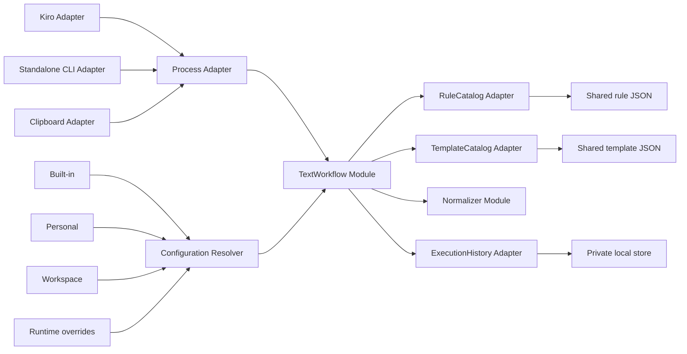
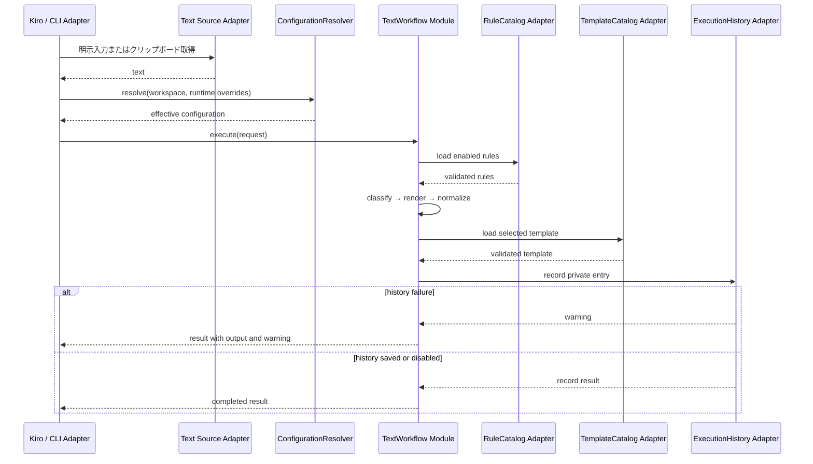

# [CW-0027] 設計書: Text Workflow / Kiro Integration

## 0. 文書の位置付け

本書は `text-workflow-kiro-integration` の低レベル設計であり、実装コード、要件書、タスク一覧は作成しない。スペックの正本は配置規約に従い `.kiro/specs/text-workflow-kiro-integration/` に置く。`doc/` または `docs/` への複製は、実装時に利用者向け文書が必要と判断された場合だけ別途行う。

## Overview

クリップボードまたは明示入力テキストを、共有可能な規則で分類し、用途別テンプレートの展開と正規化を実行して、結果と実行記録を返すテキスト処理基盤を設計する。処理本体、規則、テンプレート、履歴は Kiro に依存せず、Kiro はホスト入力・表示・編集操作を中立な JSON 契約へ変換する薄い Adapter とする。

設定は `組込み → 個人 → ワークスペース → 実行時指定` の順に合成し、右側ほど優先する。共有対象の規則・テンプレートはバージョン管理可能なワークスペース領域に置き、履歴・資格情報・秘密値はローカル私有領域から決して共有設定へ混在させない。

### 1.1 スコープ

- テキストの取得、分類、テンプレート展開、整形、結果返却、ローカル履歴保存。
- Kiro Adapter と独立 CLI Adapter の両方から、同じ `TextWorkflow` Module を利用する。
- JSON による規則・テンプレート・設定・実行要求・応答の契約を定める。
- 既存 Clip Watcher への統合点、既存履歴との非干渉、テスト可能な seam を定める。

### 1.2 非スコープ

- Kiro 固有 SDK、コマンド登録ファイル、GUI、DB マイグレーションの実装。
- ネットワーク送信、クラウド同期、任意コード実行、任意シェル実行。
- 既存 `Plugin.process(text) -> text` に複数ステップの workflow を押し込むこと。

## Architecture



`TextWorkflow` は分類・展開・整形・監査の順序、入力不変性、結果の構造化、失敗の分離を隠蔽する deep Module とする。呼び出し側が知る Interface は一つの実行要求と一つの実行結果だけであり、Kiro と CLI は同じ外部 seam を越える。

## Components and Interfaces

### 3.1 Module 一覧

| Module                  | Interface（呼び出し側が知る契約）                              | 内部に隠蔽する実装                                                                 | Depth / 効果                                                                |
| ----------------------- | -------------------------------------------------------------- | ---------------------------------------------------------------------------------- | --------------------------------------------------------------------------- |
| `TextWorkflow`          | `execute(request) -> WorkflowResult`                           | 設定適用、分類順位、テンプレート選択、変数展開、正規化順序、履歴記録、失敗の構造化 | 1 操作で全処理を実行できるため、Kiro/CLI の呼び出し側に leverage を与える。 |
| `ConfigurationResolver` | `resolve(context, runtimeOverrides) -> EffectiveConfiguration` | 層探索、スキーマ検証、深いマージ、由来追跡、機密キー拒否                           | 優先順位ロジックを一箇所に集約し locality を保つ。                          |
| `Classifier`            | `classify(text, rules, hint) -> Classification`                | 規則の妥当性、優先度・ID の安定順、正規表現制限、既定分類                          | 呼び出し側は規則走査を知らない。                                            |
| `TemplateRenderer`      | `render(template, variables) -> RenderedText`                  | 変数許可リスト、既定値、未解決変数、エスケープ、サイズ制限                         | テンプレートの文字列置換を安全に一貫させる。                                |
| `Normalizer`            | `normalize(text, profile) -> NormalizedText`                   | 改行・空白・Unicode・末尾処理の順序と冪等性                                        | 用途別整形の詳細を隠蔽する。                                                |
| `ExecutionHistory`      | `record(entry) -> HistoryRecordResult`                         | 私有ストア、保持数、暗号化可否、失敗時の劣化、削除                                 | 本文保存の安全性とストレージ選択を局所化する。                              |

### 3.2 中立な Interface

以下は設計上の Interface であり、実装言語の型定義ではない。本文・設定・結果は入力後に変更しない。

```pascal
TYPE SourceKind = (EXPLICIT_TEXT, CLIPBOARD)
TYPE ExecutionStatus = (COMPLETED, COMPLETED_WITH_WARNING, REJECTED, FAILED)

STRUCTURE WorkflowRequest
  request_id: String                 // 呼び出しごとに一意
  source_kind: SourceKind
  input_text: String                 // Core に渡る時点で必ず実体化済み
  workspace_root: Optional String
  category_hint: Optional String
  template_id: Optional String
  normalization_profile: Optional String
  save_history: Boolean
  write_clipboard: Boolean           // Core は実行せず、要求として返すだけ
  runtime_overrides: Map
  host: Optional HostContext
END STRUCTURE

STRUCTURE Classification
  category_id: String
  matched_rule_id: Optional String
  confidence: Number                 // 0.0 から 1.0
  tags: List of String
END STRUCTURE

STRUCTURE WorkflowResult
  request_id: String
  status: ExecutionStatus
  output_text: Optional String
  classification: Optional Classification
  applied_template_id: Optional String
  applied_normalizers: List of String
  history: HistoryRecordResult
  warnings: List of Diagnostic
  error: Optional WorkflowError
END STRUCTURE

INTERFACE TextWorkflow
  FUNCTION execute(request: WorkflowRequest): WorkflowResult
END INTERFACE

INTERFACE ConfigurationResolver
  FUNCTION resolve(context: ResolutionContext, runtime: Map): EffectiveConfiguration
END INTERFACE

INTERFACE ExecutionHistory
  FUNCTION record(entry: HistoryEntry): HistoryRecordResult
  FUNCTION delete(record_id: String): Boolean
  FUNCTION purge(policy: RetentionPolicy): PurgeResult
END INTERFACE
```

`input_text` が空文字列であることと、テキストが未取得であることは区別する。後者は Adapter が `INPUT_UNAVAILABLE` として失敗を返し、Core へ不完全な要求を渡さない。`write_clipboard` は結果に対するホスト側の副作用要求であり、Core が OS クリップボードを直接操作してはならない。

### 3.3 seam と Adapter

| seam の位置            | Production Adapter                | Test Adapter               | 契約上の要点                                                     |
| ---------------------- | --------------------------------- | -------------------------- | ---------------------------------------------------------------- |
| `TextWorkflow` の外側  | Kiro Adapter、CLI Adapter         | In-process Request Adapter | JSON request/result のみを通し、Kiro 型を Core に渡さない。      |
| テキスト取得           | OS Clipboard Adapter              | FixedTextSource Adapter    | 取得成功時だけ文字列を返す。監視・ポーリングは Core の責務外。   |
| 規則・テンプレート取得 | JSON Catalog Adapter              | InMemory Catalog Adapter   | 共有カタログに秘密値を含めない。読み取り時に schema を検証する。 |
| 私有履歴               | Local SQLite/暗号化ストア Adapter | InMemory History Adapter   | 一意 ID と保持方針を守る。保存失敗は変換結果を破棄しない。       |
| 秘密値解決             | OS Credential Store Adapter       | Rejecting Secret Adapter   | 秘密そのものは設定・テンプレート・履歴に書き込まない。           |
| クリップボード出力     | OS Clipboard Writer Adapter       | Recording Clipboard Writer | 明示許可された場合だけ実行する。                                 |

Kiro Adapter と CLI Adapter は、同じ Process seam を満たす別の Adapter とする。Kiro Adapter は Kiro の選択テキスト・アクティブワークスペース・ユーザー操作を `WorkflowRequest` に変換し、結果を Kiro の表示または編集操作へ戻すだけである。CLI Adapter は標準入力 JSON を同じ要求へ変換して標準出力 JSON を返す。どちらも分類規則やテンプレート展開を再実装しない。

### 3.4 既存 Clip Watcher との接続方針

既存の `ClipboardMonitor` は Tk の `after` による主スレッド上のポーリング、`ApplicationBuilder` による依存性注入、`HistoryService` と SQLite、`EventDispatcher` を使用する。新しい workflow を同期の監視ループまたは既存 `Plugin.process(text) -> text` に入れると、複数ステップの設定・履歴・外部実行の責務が混在する。

統合時は `ApplicationBuilder` が Text Workflow の Catalog/History/Adapter を組み立て、UI またはイベントハンドラが `TextWorkflow.execute` をバックグラウンド実行する。完了後に UI スレッドへ `TEXT_WORKFLOW_COMPLETED` または `TEXT_WORKFLOW_FAILED` を戻す。既存クリップボード履歴を書き換える明示操作だけは `UpdateHistoryCommand` を通して Undo/Redo を維持し、workflow 実行履歴は専用の私有ストアへ保存する。

## 4. 処理フロー

### 4.1 共通実行フロー



### 4.2 主要アルゴリズム

#### `resolveConfiguration`

**事前条件**
- 各設定層は JSON object、または存在しない層として扱える。
- runtime overrides は機密値を含まない。

**事後条件**
- 有効設定の各キーは、同キーを定義する最も優先度の高い有効層から得る。
- 無効な必須設定または禁止された機密キーは、由来を含む診断で拒否する。
- 入力層のオブジェクトを変更しない。

**ループ不変条件**
- 処理済みの層について、`effective` はその範囲での最高優先値だけを持つ。

```pascal
PROCEDURE resolveConfiguration(built_in, personal, workspace, runtime)
  INPUT: 4 個の Optional JSON Object
  OUTPUT: EffectiveConfiguration または ConfigurationError

  layers ← [built_in, personal, workspace, runtime]
  effective ← empty object
  provenance ← empty map

  FOR EACH layer IN layers DO
    IF layer IS absent THEN
      CONTINUE
    END IF

    validateObject(layer)
    rejectSecretValuesAndUnknownCriticalKeys(layer)
    effective ← deepOverlay(effective, layer)
    provenance ← recordWinningKeys(provenance, layer.source)
  END FOR

  validateEffectiveConfiguration(effective)
  RETURN EffectiveConfiguration(effective, provenance)
END PROCEDURE
```

#### `execute`

**事前条件**
- `request.input_text` は取得済みで、設定上限以内の UTF-8 テキストである。
- effective configuration、規則カタログ、テンプレートカタログは schema 検証済みである。

**事後条件**
- 成功時、出力は分類・選択済みテンプレート・正規化プロファイルに決定的に対応する。
- `save_history = false` のとき、履歴 Adapter を呼ばない。
- 履歴保存のみが失敗した場合、変換済み出力を `COMPLETED_WITH_WARNING` で返す。
- いかなる結果でも元の `input_text` を変更しない。

**ループ不変条件**
- 各正規化ステップ後の `current_text` は、既に適用済みステップの順序を反映し、未適用ステップの副作用を含まない。

```pascal
PROCEDURE execute(request)
  INPUT: request: WorkflowRequest
  OUTPUT: WorkflowResult

  validateRequest(request)
  configuration ← configuration_resolver.resolve(request.context, request.runtime_overrides)
  classification ← classifier.classify(request.input_text, configuration.rules, request.category_hint)
  template ← selectTemplate(classification, request.template_id, configuration.templates)
  rendered ← template_renderer.render(template, buildAllowedVariables(request, classification))
  current_text ← rendered

  FOR EACH normalizer IN selectNormalizers(classification, request, configuration) DO
    current_text ← normalizer.normalize(current_text)
  END FOR

  result ← completedResult(request, current_text, classification, template)

  IF request.save_history THEN
    history_result ← execution_history.record(toHistoryEntry(request, result, configuration.history))
    result.history ← history_result
    IF history_result.status IS FAILED THEN
      result.status ← COMPLETED_WITH_WARNING
      result.warnings.add(history_result.diagnostic)
    END IF
  END IF

  RETURN result
END PROCEDURE
```

#### `classify`

**事前条件**
- 規則 ID はカタログ内で一意、優先度は整数、正規表現は安全な制約を通過済みである。

**事後条件**
- hint が有効なら hint を採用する。そうでなければ `(priority ASC, rule_id ASC)` の最初の一致規則を採用する。
- 一致規則がない場合は設定済みの `default_category` を返す。

**ループ不変条件**
- 確認済みの規則に、未確認規則より先に選ばれる一致規則は存在しない。

```pascal
PROCEDURE classify(text, rules, category_hint)
  INPUT: text, validated rules, optional category_hint
  OUTPUT: Classification

  IF category_hint IS a known enabled category THEN
    RETURN hintedClassification(category_hint)
  END IF

  ordered_rules ← sort rules BY priority ascending, rule_id ascending
  FOR EACH rule IN ordered_rules DO
    IF ruleMatches(rule, text) THEN
      RETURN Classification(rule.category_id, rule.rule_id, rule.confidence, rule.tags)
    END IF
  END FOR

  RETURN defaultClassification()
END PROCEDURE
```

#### `renderTemplate`

**事前条件**
- テンプレートは許可された `{{variable}}` 構文だけを含む。
- 変数値は文字列であり、テンプレート自体・環境変数・シェルを評価しない。

**事後条件**
- 許可変数は値またはテンプレート既定値で置換される。
- 未解決の必須変数は出力を作らず `TEMPLATE_VARIABLE_MISSING` を返す。
- 同じテンプレートと変数なら同じ結果を返す。

```pascal
PROCEDURE renderTemplate(template, variables)
  INPUT: validated template, allowed variables
  OUTPUT: String または TemplateError

  output ← template.body
  FOR EACH placeholder IN template.placeholders DO
    value ← variables.get(placeholder.name, template.defaults.get(placeholder.name))
    IF value IS absent AND placeholder.required THEN
      RAISE TEMPLATE_VARIABLE_MISSING(placeholder.name)
    END IF
    output ← replaceExactPlaceholder(output, placeholder, escapeAsText(value))
  END FOR

  ASSERT containsNoTemplateSyntax(output)
  RETURN output
END PROCEDURE
```

## Data Models

### 5.1 設定レイヤーと保存場所

| 区分           | 例示パス                                                | 共有可否       | 含めてよいもの                           | 含めてはならないもの                         |
| -------------- | ------------------------------------------------------- | -------------- | ---------------------------------------- | -------------------------------------------- |
| 組込み         | パッケージ同梱 `defaults/`                              | 読み取り専用   | 既定カテゴリ、上限、安全な既定値         | 個人情報、秘密値                             |
| 個人           | OS のユーザー設定領域 `text-workflow/config.json`       | 原則ローカル   | 個人の有効/無効、表示、保持方針          | 生の資格情報                                 |
| ワークスペース | `<workspace>/.text-workflow/`                           | 共有・版管理可 | 規則、テンプレート、用途別プロファイル   | 履歴、トークン、復号鍵                       |
| 実行時         | stdin JSON または Kiro Adapter のメモリ                 | 永続化しない   | 明示的な上書き、入力、カテゴリ hint      | 秘密値、記録不要の入力をログへ複製したもの   |
| 私有状態       | OS のローカル state 領域 `text-workflow/history.sqlite` | 共有不可       | 実行履歴、暗号化済み本文、削除メタデータ | ワークスペースで共有すべき規則・テンプレート |

ワークスペースの `.text-workflow/` は規則・テンプレートを共有する唯一の標準位置とし、私有状態と同名のファイルを置かない。個人・私有領域を誤ってリポジトリに入れないため、実装時は各プロジェクトの `.gitignore` に私有パスを追加する。Kiro 固有の設定は Kiro Adapter の設定に限定し、Core の effective configuration へはホスト中立な値だけを渡す。

### 5.2 設定 JSON

設定 object は深く overlay する。ただし配列は暗黙結合せず、配列単位で上位層が置換する。これにより規則や正規化順序の偶発的な二重実行を防ぐ。各 object は `schemaVersion` を持ち、未知の critical key、型不一致、範囲外値を拒否する。

```json
{
  "schemaVersion": 1,
  "workflow": {
    "defaultCategory": "general",
    "maxInputBytes": 1048576,
    "maxOutputBytes": 1048576,
    "defaultTemplateId": "plain",
    "normalizationProfiles": {
      "plain": ["normalize-newlines", "trim-trailing-space"],
      "issue": ["normalize-newlines", "trim-trailing-space", "ensure-final-newline"]
    }
  },
  "history": {
    "enabled": true,
    "contentPolicy": "redacted",
    "retentionDays": 30,
    "maxRecords": 500
  },
  "security": {
    "allowClipboardWrite": false,
    "allowUntrustedWorkspaceRules": false
  }
}
```

`contentPolicy` は `none`、`redacted`、`encrypted-full` のいずれかとする。既定は `redacted` とし、OS の資格情報ストアが使用できない場合に `encrypted-full` を選べない。`allowUntrustedWorkspaceRules` の既定 `false` は、信頼済みと確認されないワークスペースからの自動実行を止める。

### 5.3 分類規則 JSON

規則は宣言的に評価し、正規表現以外のスクリプト・コマンド・外部 URL は許可しない。カテゴリ ID とテンプレート ID はカタログ内に実在しなければならない。

```json
{
  "schemaVersion": 1,
  "rules": [
    {
      "id": "meeting-notes",
      "enabled": true,
      "priority": 100,
      "when": {
        "all": [
          { "kind": "contains", "value": "議事録" },
          { "kind": "maxLength", "value": 50000 }
        ]
      },
      "categoryId": "meeting",
      "templateId": "meeting-summary",
      "normalizationProfile": "plain",
      "tags": ["shared", "meeting"]
    }
  ]
}
```

`when` は `all`、`any`、`not`、`contains`、制限付き `regex`、`minLength`、`maxLength`、`languageHint` を許可する。実装時には最大パターン長・最大規則数・一致評価時間を制限し、ReDoS を起こし得るパターンを検出または timeout とする。

### 5.4 テンプレート JSON

テンプレートは用途別に共有できるが、秘密値を埋め込まない。変数は `input`、`category`、`tags`、`date`、`workspaceName`、明示入力の `variables` だけを許可し、環境変数参照や任意式評価は許可しない。

```json
{
  "schemaVersion": 1,
  "templates": [
    {
      "id": "meeting-summary",
      "title": "議事録要約の下書き",
      "categories": ["meeting"],
      "body": "## 要約\n{{input}}\n\n## 次のアクション\n- ",
      "variables": [
        { "name": "input", "required": true },
        { "name": "workspaceName", "required": false, "default": "" }
      ]
    }
  ]
}
```

### 5.5 実行要求・応答 JSON

Kiro Adapter と CLI Adapter が共有する外部契約は JSON Lines とする。入力本文はコマンドライン引数へ入れず、標準入力一行で受け取る。標準出力には一要求につき一応答だけを出力し、診断ログは標準エラーへ出す。ただし標準エラーにも生テキスト・秘密値を出してはならない。

```json
{
  "schemaVersion": 1,
  "requestId": "8ae4f7d4-c5e5-44b9-a37a-7c35b596ee37",
  "input": { "kind": "text", "text": "議事録: 次回は火曜" },
  "workspaceRoot": "C:/work/example",
  "options": {
    "categoryHint": null,
    "templateId": null,
    "normalizationProfile": null,
    "saveHistory": true,
    "writeClipboard": false
  },
  "runtimeOverrides": {},
  "host": { "kind": "kiro", "interaction": "explicit-command" }
}
```

```json
{
  "schemaVersion": 1,
  "requestId": "8ae4f7d4-c5e5-44b9-a37a-7c35b596ee37",
  "status": "completed",
  "output": {
    "text": "## 要約\n議事録: 次回は火曜\n\n## 次のアクション\n- ",
    "categoryId": "meeting",
    "matchedRuleId": "meeting-notes",
    "templateId": "meeting-summary",
    "normalizers": ["normalize-newlines", "trim-trailing-space"]
  },
  "history": { "status": "saved", "recordId": "local-only-id" },
  "warnings": [],
  "error": null
}
```

エラー時も JSON 応答を返す。`error` は `code`、安全な `message`、`retryable`、`details` を持つ。本文、テンプレート本文、秘密値、絶対ローカルパスを `details` に入れない。

## 6. Kiro 連携

### 6.1 Kiro Adapter の責務

1. ユーザーの明示操作で選択テキストまたは入力欄のテキストを取得する。選択がない場合だけ、確認済みのクリップボード入力を要求する。
2. Kiro のアクティブワークスペースを `workspaceRoot` として渡し、Kiro 内の設定を中立な runtime override に変換する。
3. 標準入力 JSON で独立 CLI を起動するか、同一プロセスで中立 Interface を呼ぶ。どちらの経路でも Core への契約は同じである。
4. 結果テキストをプレビューし、ユーザーが選んだ場合にだけエディタへ挿入・置換またはクリップボード書込みを行う。
5. 構造化エラーを Kiro の通知へ写像し、機密情報を表示・記録しない。

Kiro Adapter は規則読込み、設定マージ、分類、テンプレート展開、履歴永続化を持たない。これにより Kiro を外しても独立 CLI が同じ結果を返す。

### 6.2 Kiro Adapter の処理

```pascal
PROCEDURE runFromKiro(selection, workspace, user_options)
  INPUT: Kiro から得た選択テキスト、ワークスペース、明示オプション
  OUTPUT: Kiro 表示または編集操作

  IF selection IS absent THEN
    selection ← requestConfirmedClipboardText()
  END IF

  request ← toNeutralRequest(selection, workspace, user_options)
  result ← invokeTextWorkflow(request)

  IF result.status IS COMPLETED OR result.status IS COMPLETED_WITH_WARNING THEN
    showPreview(result.output_text, result.warnings)
    IF userConfirmsApply() THEN
      applyTextThroughKiroHostAdapter(result.output_text)
    END IF
  ELSE
    showSafeDiagnostic(result.error)
  END IF
END PROCEDURE
```

Kiro 統合は既定で `explicit-command` のみとし、貼り付け・選択・クリップボード変更に対する自動処理をしない。自動実行を追加する場合も、ワークスペース信頼、実行前確認、入力サイズ上限、履歴方針のすべてを満たす別設定を必要とする。

## 7. 独立 CLI 実行

CLI は Kiro のない環境でも同じ JSON 契約を提供する。概念上の入口は `text-workflow run --workspace <path> --input-json - --output-json -` とし、`--from-clipboard` は CLI の Clipboard Adapter に限定する。実行形式は次の規則を守る。

- `run`: 一つの request を処理し、一つの response を標準出力へ出す。
- `validate`: 規則・テンプレート・設定の JSON schema、参照整合性、安全制約を検査する。本文や履歴を作成しない。
- `--workspace`: ワークスペース層を探索する起点であり、私有履歴の保存先を変えない。
- stdin を優先し、テキスト本文・秘密値を引数、環境変数、プロセス一覧に露出させない。
- exit code は `0=completed`、`2=rejected validation/input`、`3=runtime failure` とし、履歴だけの失敗で結果が返る場合は `0` と warning を用いる。

```pascal
PROCEDURE runFromCli(stdin_json, workspace_option)
  INPUT: JSON Lines request, optional workspace path
  OUTPUT: JSON Lines response and exit code

  request ← parseAndValidateRequest(stdin_json)
  request.workspace_root ← selectWorkspace(request.workspace_root, workspace_option)
  result ← text_workflow.execute(request)
  writeOneSafeJsonLine(result)
  exitWithMappedCode(result)
END PROCEDURE
```

## 8. 履歴・セキュリティ

### 8.1 履歴モデル

workflow 実行履歴は既存 `t_clipboard_history` と別の私有ストアに置く。既存履歴の `float` 化された UI ID を workflow の恒久 ID に使用しない。workflow 履歴は UUID、時刻、分類、規則/テンプレート ID、正規化プロファイル、内容ハッシュ、保存方針、結果状態を持つ。

```pascal
STRUCTURE HistoryEntry
  record_id: String
  created_at: Timestamp
  request_id: String
  input_hash: String
  output_hash: String
  category_id: String
  rule_id: Optional String
  template_id: Optional String
  normalizers: List of String
  content_policy: (NONE, REDACTED, ENCRYPTED_FULL)
  redacted_input_preview: Optional String
  redacted_output_preview: Optional String
  encrypted_payload_ref: Optional String
  status: ExecutionStatus
END STRUCTURE
```

- `NONE`: ハッシュ・メタデータのみ。本文・プレビューを保存しない。
- `REDACTED`: 秘密検出規則で伏字化した短いプレビューとハッシュだけを保存する既定値。
- `ENCRYPTED_FULL`: OS の資格情報ストアから得る鍵参照で暗号化した本文を私有ストアにのみ保存する。鍵取得に失敗したら `REDACTED` へ安全に劣化し warning を返す。
- 保存・削除・保持期限の操作は個人ローカルで完結し、ワークスペースファイル、Kiro telemetry、CLI 標準エラーへ本文を複製しない。

### 8.2 安全制約

- 秘密値は共有 JSON の値、テンプレート本文、runtime overrides、Kiro Adapter のログに入れない。必要時は `secretRef` だけを許可し、解決は OS Credential Store Adapter に限定する。
- テンプレートは受動的な文字列置換だけとし、式評価、ファイル読取り、環境変数展開、ネットワーク、シェル、プラグインコードを実行しない。
- 分類規則の正規表現はパターン数、長さ、評価時間を制限する。制限を超える規則はワークスペース全体を止めず、その規則を無効化して安全な診断を返す。
- 入出力は既定で 1 MiB 以下とし、超過時は保存も展開も行わない。
- クリップボード出力・Kiro 編集は明示確認を必要とし、処理後に入力を自動消去・上書きしない。
- ワークスペースの規則/テンプレートはコードではないが、不信頼ワークスペースでは自動実行しない。

## Error Handling

| code                        | 条件                                 | 応答                                          | 回復                                                 |
| --------------------------- | ------------------------------------ | --------------------------------------------- | ---------------------------------------------------- |
| `INPUT_UNAVAILABLE`         | クリップボードを読めない、選択がない | `REJECTED`、本文を含まない診断                | 明示入力、または取得権限を確認する。                 |
| `INPUT_TOO_LARGE`           | 上限超過                             | `REJECTED`                                    | 入力を短縮するか安全な上限を設定する。               |
| `CONFIG_INVALID`            | JSON/型/層の整合性が不正             | `REJECTED`、層名と JSON path                  | `validate` で該当設定を修正する。                    |
| `RULE_INVALID`              | 規則参照不正・危険な regex           | `REJECTED` または該当規則を無効化した warning | 規則を修正し再検証する。                             |
| `CATEGORY_UNKNOWN`          | hint/category が無効                 | `REJECTED`                                    | category ID を選び直す。                             |
| `TEMPLATE_NOT_FOUND`        | 選択・規則指定 template がない       | `REJECTED`                                    | テンプレートを追加するか既定へ戻す。                 |
| `TEMPLATE_VARIABLE_MISSING` | 必須変数が未解決                     | `REJECTED`                                    | 明示 variable を渡すか template default を設定する。 |
| `HISTORY_WRITE_FAILED`      | 私有ストア/鍵への保存失敗            | `COMPLETED_WITH_WARNING`                      | 出力を利用できる。保存先・鍵を修復して再実行する。   |
| `HOST_APPLY_FAILED`         | Kiro 編集・クリップボード書込み失敗  | Core 結果は保持、Host 側で失敗表示            | 結果をコピー/再試行し、入力変換を再実行しない。      |
| `INTERNAL_ERROR`            | 予期しない内部失敗                   | `FAILED`、相関 ID のみ                        | 秘密を伏せた診断を確認する。                         |

失敗の責務を分ける。入力・設定・分類・展開の失敗は出力を返さない。一方、出力が確定した後の履歴保存や Host への適用失敗は、確定済みの `output_text` と相関 ID を失わせない。

## Correctness Properties

`requirements.md` は意図的に未作成であり、本書は設計のみを定義する。形式上の `Requirements 0.0` は、この設計書に限って「要件書未作成・設計不変条件のみを検証する」ことを表す予約トークンである。未作成の要件を参照するものではない。要件書を作成する場合は、各 Property の `Requirements 0.0` を対応する `Requirements X.Y` へ置換する。

### Property 1: 設定優先

任意のキー `k` について、runtime、workspace、personal、built-in の順で最初に `k` を定義する有効層の値だけが effective configuration の `k` となる。

**Validates: Requirements 0.0**

### Property 2: 入力不変

任意の有効 request について、`execute` の前後で `request.input_text` は同じ文字列である。

**Validates: Requirements 0.0**

### Property 3: 分類決定性

同一のテキスト、規則、hint、設定からの分類結果は常に同一である。優先度が等しい場合は rule ID の昇順で決まる。

**Validates: Requirements 0.0**

### Property 4: テンプレート安全性

任意のテンプレート展開は許可変数だけを文字列として出力し、外部副作用を実行しない。

**Validates: Requirements 0.0**

### Property 5: 正規化冪等性

同じ profile の各 normalizer は `normalize(normalize(x)) = normalize(x)` を満たす。満たさない normalizer は profile に登録できない。

**Validates: Requirements 0.0**

### Property 6: 履歴分離

`save_history=false` の request は ExecutionHistory Adapter を呼ばず、共有カタログへ書込みを行わない。

**Validates: Requirements 0.0**

### Property 7: 履歴劣化安全性

history record が失敗しても、変換が完了した場合の `output_text` は変わらず、結果は warning を持つ。

**Validates: Requirements 0.0**

### Property 8: Kiro 独立性

同一 request JSON を Kiro Adapter と CLI Adapter から実行したとき、Host 適用を除く `output`、分類、template ID、normalizer 列は一致する。

**Validates: Requirements 0.0**

## Testing Strategy

| 対象                    | 方針                                 | 主な検証                                                                                |
| ----------------------- | ------------------------------------ | --------------------------------------------------------------------------------------- |
| `ConfigurationResolver` | 単体・プロパティベーステスト         | 全キーに対する優先順位、深い object overlay、配列置換、無効層の拒否、入力非変更。       |
| `Classifier`            | 単体・プロパティベーステスト         | priority/ID の安定順、hint 優先、既定分類、制限超過 regex の隔離。                      |
| `TemplateRenderer`      | 単体テスト                           | 必須/任意変数、文字列エスケープ、未解決変数、テンプレート構文の残留なし、外部評価なし。 |
| `Normalizer`            | プロパティベーステスト               | 冪等性、最大出力長、Unicode/改行/空白の境界値。                                         |
| `TextWorkflow`          | in-memory Adapter を用いた統合テスト | 分類→展開→整形→履歴の順序、history failure での warning、保存無効時の非呼出。           |
| JSON Catalog            | 契約テスト                           | schemaVersion、参照整合性、互換性破壊を伴う変更の拒否。                                 |
| CLI Adapter             | プロセス統合テスト                   | stdin 一行/ stdout 一行、exit code、stderr に本文を含めないこと。                       |
| Kiro Adapter            | Host Adapter contract test           | 選択テキスト変換、プレビュー後だけ編集、Core に Kiro 型を渡さないこと。                 |
| 私有履歴                | 統合・セキュリティテスト             | ワークスペース非混入、redacted/encrypted の方針、保持削除、鍵不在時の安全な劣化。       |

プロパティベーステストでは、設定 object、規則順、テンプレート変数、Unicode テキストを生成する。外部 OS クリップボード、Kiro、資格情報ストアは Adapter fake へ置き換え、Core のテストを環境依存にしない。

## 12. 実装イメージ（コードではない）

実装時の配置候補は次のとおりである。これは責務の配置を示すだけであり、ここでコードファイルを作成しない。

```text
text_workflow/
  core/                 # TextWorkflow, Classifier, TemplateRenderer, Normalizer
  configuration/        # ConfigurationResolver, schema, provenance
  catalogs/             # RuleCatalog / TemplateCatalog Interface と JSON Adapter
  history/              # ExecutionHistory Interface と private-store Adapter
  adapters/
    cli/                # stdin/stdout JSON Lines
    clipboard/          # OS clipboard read/write
    kiro/               # Kiro 固有の薄い Host Adapter
  contracts/            # request/result/error schema
  tests/                # fake Adapter と contract/property tests
```

既存アプリケーションへ入れる場合は、`ApplicationBuilder` で依存を生成して注入し、既存 `HistoryService` と混同しない `TextWorkflowExecutionHistory` を登録する。UI は `TextWorkflow` Interface のみを呼び、長時間処理を Tk のクリップボード監視 callback や同期 `EventDispatcher` listener 内で実行しない。Kiro 統合を先に導入する場合も CLI Adapter を最初に確立して同一の JSON contract を契約テストで固定する。

この構成により、共有規則・テンプレートは Kiro 外でも再利用でき、Kiro 側の変更は薄い Adapter に局所化される。履歴と秘匿情報は常に私有領域に留まり、利用者は Kiro、CLI、将来の別 Host から同一のテキスト workflow を利用できる。
