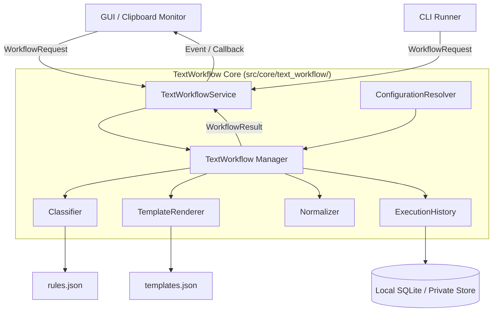

# 設計書: Text Workflow (Python / Clip_Watcher Integration)

## 1. 概要 (Overview)

本設計書は、Clip_Watcher 内でクリップボードテキストまたは明示入力テキストを構造的に分類し、テンプレート展開・テキスト正規化を行い、その結果と実行履歴を安全に記録・返却する Python 製テキスト処理基盤 (`TextWorkflow`) の仕様・設計を定義する。

外部ツールへの依存を排し、Python の標準ライブラリおよび Clip_Watcher の既存コンポーネント (`ApplicationBuilder`, `EventDispatcher`, `HistoryService`) と柔軟かつ安全に接続可能なモジュール群として設計する。

### 1.1 スコープ

- **テキスト分類 (Classifier)**: ルール (正規表現、キーワード、テキスト長等) による自動カテゴリ判定。
- **テンプレート展開 (TemplateRenderer)**: 安全な変数埋め込み (`{{input}}`, `{{date}}` 等) による動的テキスト生成。
- **テキスト正規化 (Normalizer)**: 改行コード統一、末尾空白トリム、Unicode正規化等の前処理・後処理。
- **設定レイヤー合成 (ConfigurationResolver)**: 組み込み・ユーザー設定・ワークスペース設定・実行時オーバーライドの階層マージ。
- **専用実行履歴 (ExecutionHistory)**: 既存のクリップボード履歴とは独立した Workflow 実行結果の保存。
- **Clip_Watcher 統合**: GUI/イベント駆動による非同期実行 seam の提供。

### 1.2 非スコープ
- クライアント・サーバー間通信やクラウド同期機能。
- 任意の Python コード/シェルコマンドの動的評価・実行。

---

## 2. アーキテクチャ (Architecture)



`TextWorkflow` は分類・展開・正規化・履歴記録の順序制御と失敗分離をカプセル化するディープモジュールとする。呼び出し側は単一の `WorkflowRequest` を渡し、`WorkflowResult` を受け取るのみで完結する。

---

## 3. Python モジュール設計 & データモデル (Data Models)

Python の `dataclasses` および `enum` を用いて型安全かつ不変 (immutable) なデータ構造を提供する。

```python
from dataclasses import dataclass, field
from enum import Enum, auto
from typing import Optional, Dict, Any, List


class SourceKind(Enum):
    EXPLICIT_TEXT = auto()
    CLIPBOARD = auto()


class ExecutionStatus(Enum):
    COMPLETED = auto()
    COMPLETED_WITH_WARNING = auto()
    REJECTED = auto()
    FAILED = auto()


@dataclass(frozen=True)
class Classification:
    category_id: str
    matched_rule_id: Optional[str] = None
    confidence: float = 1.0
    tags: List[str] = field(default_factory=list)


@dataclass(frozen=True)
class WorkflowRequest:
    request_id: str
    source_kind: SourceKind
    input_text: str
    workspace_root: Optional[str] = None
    category_hint: Optional[str] = None
    template_id: Optional[str] = None
    normalization_profile: Optional[str] = None
    save_history: bool = True
    runtime_overrides: Dict[str, Any] = field(default_factory=dict)


@dataclass(frozen=True)
class WorkflowResult:
    request_id: str
    status: ExecutionStatus
    output_text: Optional[str] = None
    classification: Optional[Classification] = None
    applied_template_id: Optional[str] = None
    applied_normalizers: List[str] = field(default_factory=list)
    warnings: List[str] = field(default_factory=list)
    error_message: Optional[str] = None
```

---

## 4. 各コンポーネントの仕様

### 4.1 ConfigurationResolver (`src/core/text_workflow/config_resolver.py`)
設定を以下の優先度順にディープマージする (右側優先)。
`Built-in Defaults` → `User Config (~/.clip_watcher/workflow.json)` → `Workspace Config (.clip_watcher/workflow.json)` → `Runtime Overrides`

### 4.2 Classifier (`src/core/text_workflow/classifier.py`)
- JSON 定義された分類ルール (`rules.json`) を評価。
- `priority` 昇順・`rule_id` 昇順でマッチングを行い、最初にマッチしたカテゴリを割り当てる。
- 正規表現マッチング (`regex`)、部分一致 (`contains` / `containsAny`)、文字長制限 (`minLength`, `maxLength`) をサポート。
- 詳細なルール記述方法や逆引きレシピについては [HOWTO_TEXT_WORKFLOW_RULES.md](HOWTO_TEXT_WORKFLOW_RULES.md) を参照。

```json
/* rules.json の例 */
{
  "rules": [
    {
      "id": "meeting-rule",
      "priority": 10,
      "categoryId": "meeting",
      "templateId": "meeting-summary",
      "when": {
        "all": [
          { "kind": "containsAny", "values": ["議事録", "MTGノート"] },
          { "kind": "containsAny", "values": ["日時", "参加者", "決定事項"] }
        ]
      }
    }
  ]
}
```

### 4.3 TemplateRenderer (`src/core/text_workflow/template_renderer.py`)
- Python の標準文字列置換または軽量安全テンプレエンジンを利用。
- 許可する変数: `{{input}}`, `{{date}}`, `{{category}}`, `{{tags}}` および明示的に指定されたカスタム変数。
- 任意コード実行 (`eval`, `exec`) や環境変数への任意アクセスは遮断。

### 4.4 Normalizer (`src/core/text_workflow/normalizer.py`)
- 定義済みプロファイルに従い、冪等性 (`normalize(normalize(x)) == normalize(x)`) を保ってテキストを整形。
- 提供プロファイル例:
  - `normalize-newlines`: CR/LF を LF に統一。
  - `trim-trailing-space`: 各行末尾の空白を削除。
  - `ensure-final-newline`: ファイル末尾に改行を付与。
  - `unicode-nfc`: Unicode 正規化 (NFC)。

### 4.5 ExecutionHistory (`src/core/text_workflow/history.py`)
- 既存のクリップボード履歴 DB とは独立した専用テーブル (`t_workflow_history`) または SQLite ファイルに結果を記録。
- 保持上限数 (例: 直近 500 件) や有効期限による自動パージ機能をサポート。

---

## 5. Clip_Watcher との統合方針 (Integration Plan)

### 5.1 モジュール配置案

```text
src/
  core/
    text_workflow/
      __init__.py
      workflow.py          # メインコントローラー TextWorkflow
      classifier.py        # ルール判定 Classifier
      template_renderer.py # テンプレート展開
      normalizer.py        # テキスト正規化
      config_resolver.py   # 設定マージ
      history.py           # 専用履歴管理
  services/
    text_workflow_service.py # 依存注入用サービスラッパー
```

### 5.2 ApplicationBuilder への登録
`src/core/bootstrap/application_builder.py` 等で `TextWorkflowService` を初期化し、GUI / コマンドハンドラに注入する。

### 5.3 スレッド・非同期実行
テキスト処理および履歴記録は GUI メインスレッドをブロックしないよう、`concurrent.futures.ThreadPoolExecutor` または非同期タスクとして実行し、完了後に `EventDispatcher` を介して UI スレッドに結果を通知する。

---

## 6. エラーハンドリング & セキュリティ

- **入力サイズ制限**: デフォルトで 1MB 以上のテキストはパース前に拒否 (`INPUT_TOO_LARGE`)。
- **ReDoS 対策**: 分類用の正規表現パターン長・実行時間に制限を設ける。
- **安全な失敗 (Graceful Degradation)**: 履歴書き込みが失敗しても、変換されたテキスト出力自体は壊さず `COMPLETED_WITH_WARNING` として結果を返却。

---

## 7. テスト計画 (Testing Strategy)

- **単体テスト (`tests/unit/test_text_workflow.py`)**:
  - `ConfigurationResolver` の層別優先マージテスト
  - `Classifier` のルール順序・条件判定テスト
  - `TemplateRenderer` の変数置換・未定義変数テスト
  - `Normalizer` の冪等性検証
- **統合テスト (`tests/integration/test_workflow_pipeline.py`)**:
  - リクエスト受信から分類・展開・正規化・履歴記録までのパイプライン一連動作のテスト
