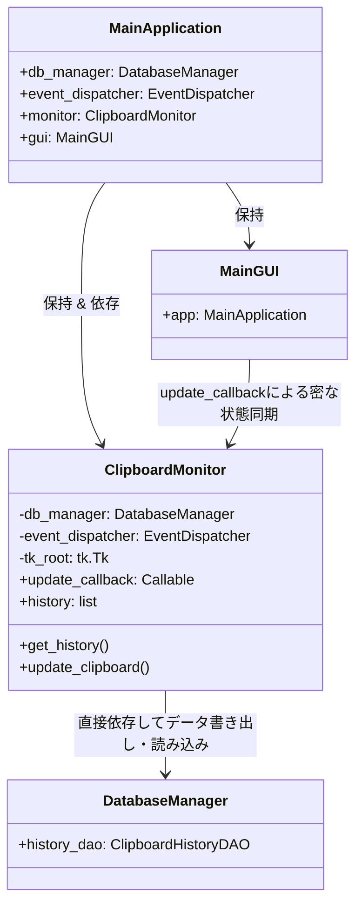
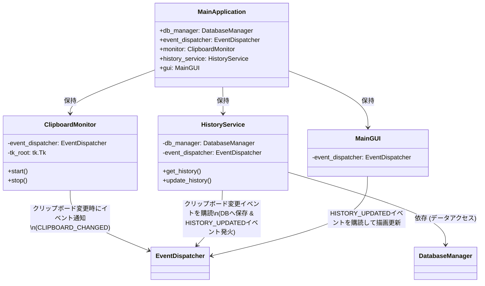

# ClipWatcher アーキテクチャレビュー (2026-05-28)

本ドキュメントでは、直近で実施されたSQLiteデータベースへの移行、メタ定型文管理機能の追加、および `refactor/general` ブランチで進められているUI・エラーハンドリング標準化を踏まえた、ClipWatcherプロジェクト全体のアーキテクチャ設計・実装に対するレビュー結果をまとめます。

---

## 1. 直近で改善・強化された点（Strengths & Recent Improvements）

直近のアップデートおよびリファクタリングにより、アプリケーションの信頼性、保守性、およびユーザー体験（UX）が劇的に向上しました。

- **SQLiteデータベース移行によるデータ整合性の確保**:
  これまでの JSON ファイルベースの履歴管理から SQLite データベースへの移行が完了しました。
  - `DatabaseManager` と各DAO (`ClipboardHistoryDAO`, `CategoryDAO`, `MetaPhraseDAO`)・DTOを仲介する堅牢なデータアクセスレイヤー（DAO/DTOパターン）が構築されています。
  - `PRAGMA foreign_keys = ON` が確実に実行され、データベースの外部キー制約（`ON DELETE CASCADE`）の恩恵により、カテゴリ削除時に紐づくメタ定型文が連動して自動削除されるなど、データ不整合が起きない仕組みになっています。
  - スレッド排他制御 (`threading.Lock`) がDAO層に適切に組み込まれており、SQLiteのマルチスレッドアクセスによる競合やロックエラーを防いでいます。

- **GUI基底クラス (BaseFrameGUI, BaseToplevelGUI) への統一**:
  メタ定型文管理画面 (`meta_management_window.py`) のリファクタリングにより、主要なGUIコンポーネントがプロジェクト共通の基底クラスを継承するようになりました。
  - Tkinterのカスタムテーマやダークモード設定が起動時に自動かつ一貫して適用されるようになり、トーンが完璧に統一されました。
  - 重複しがちだったウィジェット生成ロジックの共通化や、親ウインドウ参照の整理が進んでいます。

- **例外処理とロギングの標準化**:
  - 全てのデータベース書き込みやファイル操作を伴うイベントハンドラーに `try-except` 保護が導入されました。
  - 例外発生時にはプロジェクト標準のエラーハンドラーである `log_and_show_error` が呼び出され、詳細なスタックトレースをログに残しつつユーザーに安全なエラーダイアログを表示する設計になりました。
  - ユーザーの操作ログ（追加、編集、削除、コピー等）に他画面と同様の丁寧な日本語でのロギング (`logger.info`) が追加され、トラブルシューティング時のトレーサビリティが大幅に向上しました。

---

## 2. 依然として残る課題・改善提案（Areas for Improvement）

さらなる疎結合化と全般的なリファクタリング（`refactor/general` ブランチでの継続作業）に向けて、以下のアーキテクチャ上の課題を提示します。

### 2.1 ClipboardMonitor の単一責任原則 (SRP) 違反の継続
SQLiteへの移行により「データ永続化」のロジック自体はDAOへ分離されましたが、依然として `ClipboardMonitor` クラスが以下の複数の大きな責務を負っています。
1. **OSのクリップボード監視** (`_monitor_clipboard`, `_get_clipboard_content`, `_check_clipboard`)
2. **履歴（History）のメモリ上でのリスト状態管理** (`self.history` の保持)
3. **履歴に対する操作インターフェースの提供** (`pin_item_by_id`, `delete_history_item_by_id`, `clear_history`, `import_history` 等)

**提案**:
- メモリ上の履歴リスト状態管理と操作インターフェースを提供する **`HistoryService`** または **`HistoryManager`** を完全に分離すべきです。
- `ClipboardMonitor` は純粋に「OSクリップボードを監視して変更があればイベントを発火する」という本来の責任に集中させます。履歴の追加や削除、ピン留めなどのドメインロジックは新設した `HistoryService` に移譲することで、監視とドメインロジックが疎結合になり、単体テストが極めて容易になります。

### 2.2 後方互換用ダミーメソッドの残存
`ClipboardMonitor` 内に、JSON永続化時代の名残りである `_load_history_from_file` や `save_history_to_file` が中身のないダミー実装として残されています。これは呼び出し側コードとの密結合が残っていることを示しています。

**提案**:
- `MainApplication` や他のコンポーネントにおける `monitor.save_history_to_file()` などの古いメソッド呼び出し箇所をすべて調査し、これらを完全に廃止・削除します。
- 使用されていないファイルパス関連 of 引数（`history_file_path` など）もコンストラクタから整理すべきです。

### 2.3 EventDispatcher によるイベント駆動のさらなる推進
現在、`ClipboardMonitor` からのUI更新通知は、GUIから渡された `update_callback` の直接呼び出し (`self.update_callback(...)`) によって行われています。
プロジェクト内には強力な Pub/Sub メカニズムである `EventDispatcher` が既に導入されています。

**提案**:
- コールバックを直接渡し合う緊密な設計から脱却し、クリップボード更新や履歴の変更を `EventDispatcher` のイベント（例: `CLIPBOARD_UPDATED`, `HISTORY_CHANGED`）としてブロードキャストします。
- GUI側（`MainGUI` や各コンポーネント）がこのイベントを購読 (`subscribe`) して自発的に描画を更新するように変更することで、監視コア層とGUI層が完全に疎結合化されます。

### 2.4 クラスの紐づき（依存関係）の現状とあるべき姿
現在、`ClipboardMonitor` を中心とするクラスの紐づき（依存関係）は密結合になっており、これがテスト容易性の低下や変更時の影響範囲拡大の原因となっています。

#### 【現状のクラス紐づき (Before)】

* **課題点**: 
  - `ClipboardMonitor` が `DatabaseManager` に直接依存しており、OS監視とデータ永続化が一体化しています。
  - `MainGUI` が `ClipboardMonitor` の `update_callback` と直接繋がっており、GUIと監視ロジックの相互依存度が高いです。

#### 【推奨されるクラス紐づき (After)】
`HistoryService` を抽出し、`EventDispatcher` による Pub/Sub パターンを推し進めた場合の理想的な紐づき設計です。

* **改善効果**:
  - `ClipboardMonitor` はデータベースや履歴操作、GUIのコールバックから完全に解放され、純粋にOS監視とイベント通知のみを担当する「薄い監視レイヤー」となります。
  - 履歴の操作ロジックは `HistoryService` にカプセル化され、GUIは `EventDispatcher` を介してのみデータを購読するため、クラス間の紐づきが極めて疎結合になり、単体テストや部品の差し替えが容易になります。

---

## 3. `refactor/general` ブランチにおける次のステップ

今後 `refactor/general` ブランチでアプリ全般のリファクタリングを進めていくにあたり、リスクが低く効果の高い以下の優先順位での実行を推奨します。

1. **イベント駆動の強化**:
   - `ClipboardMonitor` の `update_callback` を廃止し、`EventDispatcher` によるイベント通知に一本化する。
2. **`HistoryService` の切り出し**:
   - `ClipboardMonitor` から履歴の操作ロジック（ピン留め、削除、一括インポートなど）を `HistoryService` に抽出し、`ClipboardMonitor` はOS監視に専念させる。
3. **古いダミーメソッドと無効な引数の完全クリーンアップ**:
   - JSON永続化関連の古いメソッドおよびパス引数をコードベース全体から完全に削除する。

---
*レビュー担当: AI Assistant (Antigravity)*
