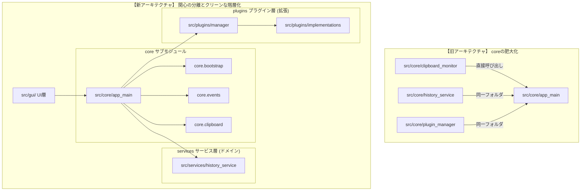

# 📋 アーキテクチャおよびディレクトリ構造に関する包括的レビュー (2026/05/31)

本ドキュメントは、Clip Watcher の現在のディレクトリ構成を「関心の分離 (Separation of Concerns)」「単一責任原則 (SRP)」「レイヤードアーキテクチャ」の観点から包括的にレビューし、肥大化しつつある `src/core` や乱雑化しつつある `src/plugins` をはじめとする全ディレクトリの改善提案をまとめたものです。

---

## 🔍 全体ディレクトリの現状と評価分析

プロジェクト配下の各モジュールについて、責任範囲と設計品質を分析しました。

| ディレクトリ | 役割 | 現状の評価・分析 | 改善推奨度 |
| :--- | :--- | :--- | :---: |
| `src/core/` | コア・ビジネスロジック | 起動処理、OS監視、ビジネスロジック、拡張機能管理、イベントバスがフラットに同居しており、最も肥大化している。責任のレイヤー分割が必要。 | 🔴 **高 (最優先)** |
| `src/db/` | データベースアクセス (DAO/DTO) | インメモリ/ファイルベースの永続化を担当。すでに `dao/` サブフォルダと `dto.py`, `database_manager.py` に整理され、非常に高い凝集度を保っている。現状で維持。 | 🟢 低 (現状維持) |
| `src/event_handlers/` | イベント処理の調整 (コントローラー) | イベント発火時のワークフロー（ファイル・履歴・設定等の操作）を制御する仲介者。ドメインサービスと協調して綺麗に分割されている。 | 🟢 低 (現状維持) |
| `src/gui/` | プレゼンテーション層 (Tkinter UI) | `base/`, `components/`, `dialogs/`, `windows/` に綺麗にサブフォルダ化されており、Tkinterを用いた設計としては極めて見通しが良い。 | 🟢 低 (現状維持) |
| `src/plugins/` | クリップボード拡張プラグイン | 共通インターフェース `base_plugin.py` と、10個以上の個別変換プラグインが同じフォルダにフラットに混在しており、拡張時に見通しが悪くなっている。 | 🟡 **中 (改善推奨)** |
| `src/utils/` | 共通ユーティリティ | `i18n.py` (多言語化) や `undo_manager.py` (元に戻す) など、横断的関心事（Cross-cutting Concerns）が簡潔にまとめられている。 | 🟢 低 (現状維持) |

---

## 🛠️ 具体的な改善・分割設計案

### 1. `src/core/` のサービスレイヤー分割（Services & Bootstrapping）

ビジネスルール（ドメイン）と、起動処理（ライフサイクル）、OS/ハードウェア依存処理（インフラ）を分離します。

#### 【新設計】ディレクトリマップ
```text
src/
├── core/
│   ├── app_main.py                 # メインオーケストレーター (UIとの境界)
│   ├── bootstrap/                  # [新設] 起動・DI・ライフサイクル
│   │   ├── application_builder.py
│   │   ├── base_application.py
│   │   ├── dependency_checker.py
│   │   └── exceptions.py
│   ├── clipboard/                  # [新設] OS監視インフラ
│   │   └── clipboard_monitor.py
│   └── events/                     # [新設] メッセージング基盤
│       ├── event_dispatcher.py
│       └── commands.py
└── services/                       # [新設] ドメイン/ビジネスロジック層 (純粋なPython)
    ├── history_service.py          # 履歴の追加・削除・ピン留め
    ├── fixed_phrases_manager.py    # 定型文の管理
    └── notification_manager.py     # OS通知の制御
```

#### 【メリット】
* **テスト容易性 (Testability)**: `src/services/history_service.py` は OS のクリップボード API から完全に分離されるため、先日のような一時ファイルDBを用いたテストをモック無しで極めてシンプルに行えます。
* **ビジネスルールの明瞭化**: 「何ができるアプリなのか」が `src/services/` を見れば一目で把握できるようになります。

---

### 2. `src/plugins/` の個別実装の隔離（Contrib/Implementations の整理）

新しいプラグインを追加しやすくするため、基盤クラスと個別実装クラスを分離します。

#### 【新設計】ディレクトリマップ
```text
src/plugins/
├── __init__.py                     # プラグインのエクスポート
├── base_plugin.py                  # 基底インターフェース
├── implementations/                # [新設] 個別のテキスト変換ロジック群
│   ├── base64_converter_plugin.py
│   ├── csv_formatter_plugin.py
│   ├── json_formatter_plugin.py
│   ├── schedule_helper_plugin.py
│   └── ... (他の10以上の変換プラグイン)
└── manager.py                      # (元 src/core/plugin_manager.py) プラグイン管理
```

#### 【メリット】
* **プラグイン追加時の独立性**: 個別プラグインを追加する際、`implementations/` の中に Python ファイルを1つ置くだけになり、コアシステム側のフォルダを汚しません。
* **プラグイン管理の集約**: プラグイン管理サービス自体を `src/core` から `src/plugins/manager.py` に移動させることで、プラグインに関わる全ての関心事が `src/plugins/` ディレクトリ内に完全にカプセル化されます。

---

## 📈 アーキテクチャ遷移のビジョン



---

## 🚀 今後の移行ロードマップ

この大規型設計移行は、以下の3段階で実行することを推奨します。

1. **第1フェーズ (ビジネスロジックの分離)**
   * `src/services/` の作成と `history_service.py` などの移動。
   * インポートパスの調整と、`pytest` による既存テストの100%成功確認（コミット）。
2. **第2フェーズ (プラグイン構成の整理)**
   * `src/plugins/implementations/` の作成と個別プラグインの移動。
   * `plugin_manager.py` を `src/plugins/manager.py` へ移動・整理（コミット）。
3. **第3フェーズ (コアサブモジュールの細分化)**
   * `core/bootstrap/`, `core/clipboard/`, `core/events/` の各フォルダ新設と移動（コミット）。
