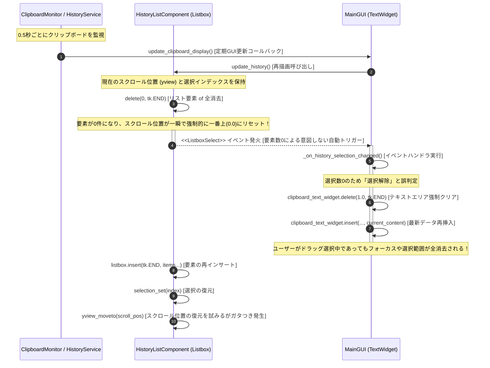

# クリップボード使用感（UX）に関する不具合調査＆改善レビュー報告書

作成日: 2026年5月28日  
対象モジュール: `HistoryListComponent`, `ClipWatcherGUI`, `ClipboardMonitor`

---

## 1. 概要 (Overview)
現在のクリップボード履歴機能において、ユーザーが快適にアプリを使用する上で極めて重大な以下の2つのUX低下（使用感の悪さ）が発生しています。
1. **スクロール位置の強制リセット**: 履歴リストをスクロールして過去の履歴を閲覧しようとしても、すぐにスクロールバーが一番上に戻されてしまう。
2. **コピー操作および編集の阻害**: 履歴のテキストエリアから文字をコピー（ドラッグ選択）しようとしたり、テキストエリアを編集しようとしている最中に、選択状態やカーソル、フォーカスが突然吹き飛んでしまう。

本ドキュメントでは、この2つの不具合の技術的な根本原因を解析し、Mermaidによるイベントシーケンス図で相互作用を視覚化するとともに、これらを完全に解消するための堅牢な改善プランを提案します。

---

## 2. 根本原因の解析 (Root Cause Analysis)

### 原因①: リスト消去に伴うスクロールバーの強制リセット
`HistoryListComponent`（履歴リストを表示する部品）が更新される際、毎回無条件に全要素を削除して再インサートする設計になっています。
```python
# src/gui/components/history_list_component.py
def update_history(
    self, history: list[tuple[str, bool, float]], theme: dict[str, str]
) -> None:
    ...
    self.listbox.delete(0, tk.END)  # 毎回すべての項目を削除
    ...
```
* **仕様上の制限**: `delete(0, tk.END)` が実行されてリストボックスの要素数が一瞬でも `0` になった瞬間、Tkinterは内部のスクロール領域（高さ）を失います。このため、**スクロールバーの位置が強制的に一番上（位置 0.0）にリセット**されます。
* 後方で `yview_moveto(scroll_pos[0])` による復元を試みていますが、要素数が一時的にゼロになったことでスクロールバー自体がガタつき、不自然に一番上に戻る不快な視覚的挙動が発生します。

---

### 原因②: リストクリア時の不要なイベント連鎖（イベント・カスケード）
最も深刻なのは、リスト消去時に発生する「イベントの負の連鎖」です。

1. リストボックスの全消去 (`delete`) により、現在選択されているアイテムが一時的に消滅し、選択数が `0` になります。
2. これを検知したTkinterは、**ユーザーが操作していないにもかかわらず、内部で `<<ListboxSelect>>` イベントを自動的に発火**します。
3. このイベントを親である `ClipWatcherGUI` (`main_gui.py`) が受信すると、イベントハンドラー `_on_history_selection_changed` が動作します。
4. 選択数が `0` であるため、メインGUIは**「ユーザーが選択を解除した」と誤認**し、上のテキストエリア (`clipboard_text_widget`) を `delete("1.0", "end")` でクリアした上で、最新のクリップボード文字列で上書きします。
5. このリフレッシュが、0.5秒おきのクリップボードチェック等でバックグラウンド実行されるため、ユーザーが上のテキストエリアでコピー（ドラッグ選択）しようとしている最中に、**テキストが勝手に消去・再挿入され、フォーカスや選択範囲がすべて吹き飛びます**。

---

## 3. 不具合発生のシーケンス図 (Visualizing the Issue)

以下は、定期的な監視処理によってリストが更新され、不要なイベントが連鎖してテキストエリアが強制リセットされる様子を示したシーケンス図です。



---

## 4. 解決策の提案 (Proposed Solutions)

この使用感の不具合を完全に解消し、プレミアムで滑らかな操作感を実現するために、以下の3つの安全な対策を提案します。

### 対策[1] : 履歴データに変化がない場合は再描画を完全にスキップする (最重要)
履歴リストが更新される際、渡された新しい履歴配列と、現在表示されている履歴配列（`self.displayed_history`）を比較し、**データに全く変更がない場合は、リストボックスの全削除・挿入処理を完全にバイパス（早期リターン）**します。
これにより、ユーザーが過去の履歴をスクロールして見ている間、リストボックスは全く干渉されず、スクロール位置が勝手に戻ることは100%なくなります。

```python
# 改善後のイメージ
def update_history(
    self, history: list[tuple[str, bool, float]], theme: dict[str, str]
) -> None:
    # 履歴データと現在のテーマ（色設定）が両方完全に同じなら何もしない
    # ※テーマ変更時（ダーク/ライト切り替え時）は再描画してピン留め背景色などを適用する必要があるため、テーマの比較も必須です。
    if (
        getattr(self, "displayed_history", None) == history
        and getattr(self, "current_theme", None) == theme
    ):
        return

    self.current_theme = theme
    ...
```

---

### 対策[2] : リスト更新中のガードフラグの導入
リストの再構築（`delete` から `insert`）を行っている間、一時的な状態ガードフラグ（`self._updating_history = True`）を導入します。
このフラグが有効な間は `<<ListboxSelect>>` のディスパッチ処理をスキップさせることで、再描画の瞬間の「要素数ゼロ」による誤認識イベント連鎖を完全に遮断します。

```python
# 改善後のイメージ
def _on_history_select(self, event: tk.Event) -> None:
    if self._updating_history:  # 再描画中のイベントは外部に通知しない
        return
    self.app.event_dispatcher.dispatch("HISTORY_SELECTION_CHANGED", ...)
```

---

### 対策[3] : テキストエリアの上書き防止（差分チェック）
メインGUIがテキストエリアを更新する際、無条件で全消去・再挿入するのではなく、**現在すでに入力されているテキストと、新しく挿入しようとしているテキストが同一である場合は、クリア＆インサート処理を実行しない**ようにガードを入れます。
これにより、同じ文字列を表示している限りテキストエリアは全く干渉されず、ユーザーのドラッグ選択、フォーカス、カーソル位置が一切リセットされなくなります。

```python
# 改善後のイメージ
current_area_text = self.clipboard_text_widget.get("1.0", "end-1c")

# ① もしユーザーがテキストエリア内の文字を「ドラッグ選択中」であれば、上書きを強制キャンセルする（コピー操作の保護）
is_text_selected = bool(self.clipboard_text_widget.tag_ranges(tk.SEL))

# ② テキストに差分がある、かつユーザーが選択操作中でない場合のみ上書きする
if current_area_text != new_insert_content and not is_text_selected:
    self.clipboard_text_widget.delete(1.0, tk.END)
    self.clipboard_text_widget.insert(tk.END, new_insert_content)
```

---

## 5. まとめ (Summary)
これらの改善を適用することで、0.5秒ごとのバックグラウンドポーリングが行われている状態でも、UIは「見えない静寂」を保ち、データが本当に変化した瞬間だけ滑らかにリストが更新されるようになります。ユーザーのスクロール操作やコピー操作への干渉は完全にゼロになり、デスクトップユーティリティとしての品質が飛躍的に向上します。
